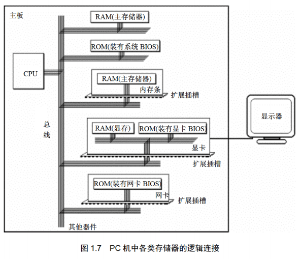
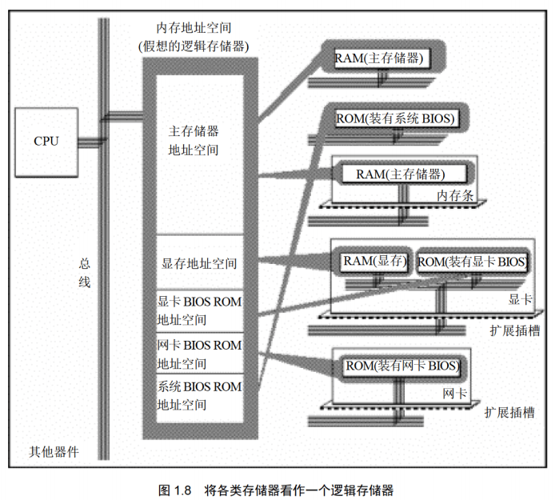
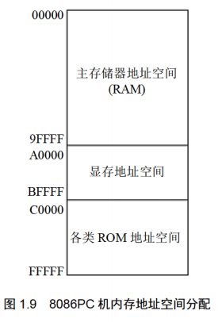

**①没有通过检测点不要向下学习； ②没有完成当前的实验不要向下学习**
## 第一章 基础知识
**学习目的：汇编课程的研宄重点放在如何利用硬件系统的编程结构和指令集有效灵活地控制系统进行工作。**
存储器被划分成多个存储单元， 存储单元从零开始顺序编号。 这些编号可以看作存储单元在存储器中的地址。  
cpu和其他芯片通过总线连接，总线从逻辑上可分为：地址总线、控制总线和数据总线。  
CPU 从 3 号单元中读取数据的过程(见图 1.3)如下。

>读一次数据需要三条总线共同完成：
(1) CPU 通过地址线将地址信息 3 发出。
(2) CPU 通过控制线发出内存读命令， 选中存储器芯片， 并通知它， 将要从中读取数据
(3) 存储器将 3 号单元中的数据 8 通过数据线送入 CPU。

一个 CPU 有 N根地址线， 则可以说这个CPU的地址总线的宽度为N。 这样的 CPU最多可以寻找2的N次方个内存单元。
数据总线的宽度决定了 CPU 和外界的数据传送速度。 8 根数据总线一次可传送一个 8 位二进制数据(即一个字节)。 16 根数据总线一次可传送两个字节。
控制总线是一些不同控制线的集合。 有多少根控制总线， 就意味着 CPU 提供了对外部器件的多少种控制。 所以， 控制总线的宽度决定了 CPU 对外部器件的控制能力。
#### 1.1~1.10小结
>(1) 汇编指令是机器指令的助记符， 同机器指令一一对应。
(2) 每一种 CPU 都有自己的汇编指令集。
(3) CPU 可以直接使用的信息在存储器中存放。
(4) 在存储器中指令和数据没有任何区别， 都是二进制信息。
(5) 存储单元从零开始顺序编号。
(6) —个存储单元可以存储8个bit，即8位二进制数。
(7) lByte=8bit 1KB=1024B 1MB=1024KB 1GB=1024MB。
(8) 每一个 CPU 芯片都有许多管脚， 这些管脚和总线相连。也可以说，这些管脚引出总线。 一个CPU 可以引出 3 种总线的宽度标志了这个 CPU 的不同方面的性能：
地址总线的宽度决定了 CPU 的寻址能力；
数据总线的宽度决定了 CPU 与其他器件进行数据传送时的一次数据传送量;
控制总线的宽度决定了 CPU 对系统中其他器件的控制能力。

#### 监测点1.1
>(1) 1个CPU的寻址能力为8KB，那么它的地址总线的宽度为(13).
(2)1KB的存储器有(1024)个存储单元。存储单元的编号从(0)到(1023).
(3)lKB的存储器可以存储(1024*8)个bit，(1024)个Byte。
(4)1GB、1MB、1KB分别是(1024\*1024\*1024,1024\*1024,1024)Byte.
(5) 8080、8088、80286、80386的地址总线宽度分别为l6 根、20 根、24根、32根，则它们的寻址能力分别为:(2^6)(KB)、(1)(MB)、(2^4)(MB)、(2^2)(GB)。
(6) 8080、8088、8086、80286、80386的数据总线宽度分别为8根、8根、16根、16根、32根。则它们一次可以传送的数据为:(1)(B)、(1)(B)、(2)(B)、(2)(B)、(4)(B)。
(7)从内存中读取1024字节的数据，8086至少要读(512)次，80386至少要读(256)次。
(8)在存储器中，数据和程序以(二进制)形式存放。

存储芯片从读写属性上可分为两类：随机存储器(RAM)和只读存储器(ROM)。
图 1.7 展示了 PC 系统中各类存储器的逻辑连接情况。
  
CPU 在操控上述存储器的时候， 把它们都当作内存来对待， 把它们总的看作
一个由若干存储单元组成的逻辑存储器， 这个逻辑存储器就是我们所说的内存地址空间。
图 1.8 展示了 CPU 将系统中各类存储器看作一个逻辑存储器的情况。
  
在图 1.8 中， 所有的物理存储器被看作一个由若干存储单元组成的逻辑存储器， 每个物理存储器在这个逻辑存储器中占有一个地址段， 即一段地址空间。 CPU 在这段地址空间中读写数据， 实际上就是在相对应的物理存储器中读写数据。

不同的计算机系统的内存地址空间的分配情况是不同的， 图 1.9 展示了 8086PC 机内存地址空间分配的基本情况。
  
