**①没有通过检测点不要向下学习； ②没有完成当前的实验不要向下学习**
## 第一章 基础知识
**学习目的：汇编课程的研宄重点放在如何利用硬件系统的编程结构和指令集有效灵活地控制系统进行工作。**
存储器被划分成多个存储单元， 存储单元从零开始顺序编号。 这些编号可以看作存储单元在存储器中的地址。  
cpu和其他芯片通过总线连接，总线从逻辑上可分为：地址总线、控制总线和数据总线。  
CPU 从 3 号单元中读取数据的过程(见图 1.3)如下。

>读一次数据需要三条总线共同完成：
(1) CPU 通过地址线将地址信息 3 发出。
(2) CPU 通过控制线发出内存读命令， 选中存储器芯片， 并通知它， 将要从中读取数据
(3) 存储器将 3 号单元中的数据 8 通过数据线送入 CPU。

一个 CPU 有 N根地址线， 则可以说这个CPU的地址总线的宽度为N。 这样的 CPU最多可以寻找2的N次方个内存单元。
数据总线的宽度决定了 CPU 和外界的数据传送速度。 8 根数据总线一次可传送一个 8 位二进制数据(即一个字节)。 16 根数据总线一次可传送两个字节。
控制总线是一些不同控制线的集合。 有多少根控制总线， 就意味着 CPU 提供了对外部器件的多少种控制。 所以， 控制总线的宽度决定了 CPU 对外部器件的控制能力。
#### 1.1~1.10小结
>(1) 汇编指令是机器指令的助记符， 同机器指令一一对应。
(2) 每一种 CPU 都有自己的汇编指令集。
(3) CPU 可以直接使用的信息在存储器中存放。
(4) 在存储器中指令和数据没有任何区别， 都是二进制信息。
(5) 存储单元从零开始顺序编号。
(6) —个存储单元可以存储8个bit，即8位二进制数。
(7) lByte=8bit 1KB=1024B 1MB=1024KB 1GB=1024MB。
(8) 每一个 CPU 芯片都有许多管脚， 这些管脚和总线相连。也可以说，这些管脚引出总线。 一个CPU 可以引出 3 种总线的宽度标志了这个 CPU 的不同方面的性能：
地址总线的宽度决定了 CPU 的寻址能力；
数据总线的宽度决定了 CPU 与其他器件进行数据传送时的一次数据传送量;
控制总线的宽度决定了 CPU 对系统中其他器件的控制能力。

#### 监测点1.1
>(1) 1个CPU的寻址能力为8KB，那么它的地址总线的宽度为(13).
(2)1KB的存储器有(1024)个存储单元。存储单元的编号从(0)到(1023).
(3)lKB的存储器可以存储(1024*8)个bit，(1024)个Byte。
(4)1GB、1MB、1KB分别是(1024\*1024\*1024,1024\*1024,1024)Byte.
(5) 8080、8088、80286、80386的地址总线宽度分别为l6 根、20 根、24根、32根，则它们的寻址能力分别为:(2^6)(KB)、(1)(MB)、(2^4)(MB)、(2^2)(GB)。
(6) 8080、8088、8086、80286、80386的数据总线宽度分别为8根、8根、16根、16根、32根。则它们一次可以传送的数据为:(1)(B)、(1)(B)、(2)(B)、(2)(B)、(4)(B)。
(7)从内存中读取1024字节的数据，8086至少要读(512)次，80386至少要读(256)次。
(8)在存储器中，数据和程序以(二进制)形式存放。

存储芯片从读写属性上可分为两类：随机存储器(RAM)和只读存储器(ROM)。
图 1.7 展示了 PC 系统中各类存储器的逻辑连接情况。
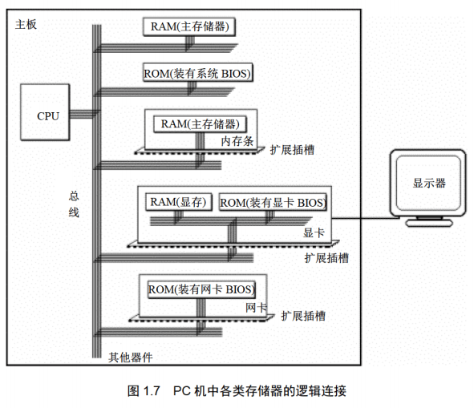  
CPU 在操控上述存储器的时候， 把它们都当作内存来对待， 把它们总的看作
一个由若干存储单元组成的逻辑存储器， 这个逻辑存储器就是我们所说的内存地址空间。
图 1.8 展示了 CPU 将系统中各类存储器看作一个逻辑存储器的情况。
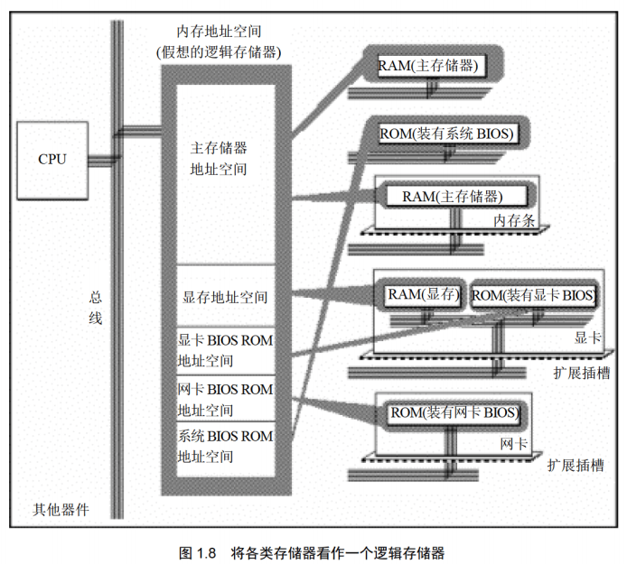  
在图 1.8 中， 所有的物理存储器被看作一个由若干存储单元组成的逻辑存储器， 每个物理存储器在这个逻辑存储器中占有一个地址段， 即一段地址空间。 CPU 在这段地址空间中读写数据， 实际上就是在相对应的物理存储器中读写数据。

不同的计算机系统的内存地址空间的分配情况是不同的， 图 1.9 展示了 8086PC 机内存地址空间分配的基本情况。
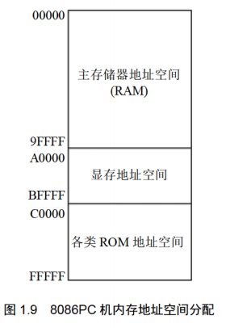  

## 第二章 寄存器
#### 通用寄存器
AX、 BX、 CX、 DX 这4个寄存器通常用来存放一般性的数据，被称为通用寄存器。其都可以分解为两个8位寄存器来使用。
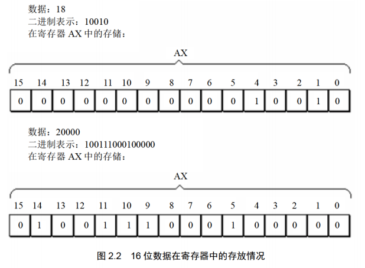  
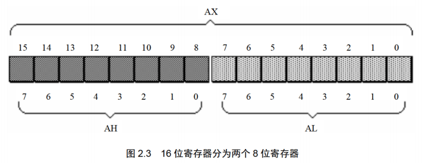  
**在以后的课程中， 为了区分不同的进制， 在十六进制表示的数据的后面加 H， 在二进制表示的数据后面加 B， 十进制表示的数据后面什么也不加。**
**在写一条汇编指令或一个寄存器的名称时不区分大小写。**
**在进行数据传送或运算时， 要注意指令的两个操作对象的位数应当是一致的。即8位寄存器对8位寄存器，16位对16位。**
>汇编加法导致溢出的情况：若超过寄存器位数限制，高位直接抛弃。
示例1：程序段中的最后一条指令 add ax,bx， 在执行前 ax 和 bx 中的数据都为 8226H， 相加后所得的值为： 1044CH， 但是 ax 为 16 位寄存器， 只能存放 4 位十六进制的数据， 所以最高位的1不能在ax中保存，ax中的数据为:044CH。
示例2：程序段中的最后一条指令 add al,93H, 在执行前， al 中的数据为 C5H， 相加后所得的值为： 158H, 但是 al 为 8 位寄存器， 只能存放两位十六进制的数据， 所以最高位的 1 丢失，ax中的数据为： 0058H。这种情况下，al作为一个独立的8为寄存器来使用，和ah没有关系，cpu在执行这条指令时认为ah和al是两个不相关的寄存器。

#### 监测点2.1（第一题略过）
>（2）只能使用目前学过的汇编指令， 最多使用 4 条指令， 编程计算 2 的 4 次方。
```bash
add ax, 2
add ax, 2
add ax, 2
add ax, 2
```
#### 16位结构的cpu
>运算器一次最多可以处理 16 位的数据
寄存器的最大宽度为 16 位；
寄存器和运算器之间的通路为 16 位。
#### 8086cpu给出物理地址的方法
8086CPU 有 20 位地址总线， 可以传送20位地址，达到1MB寻址能力。8086CPU 采用一种在内部用两个 16 位地址合成的方法来形成一个 20 位的物理地址。
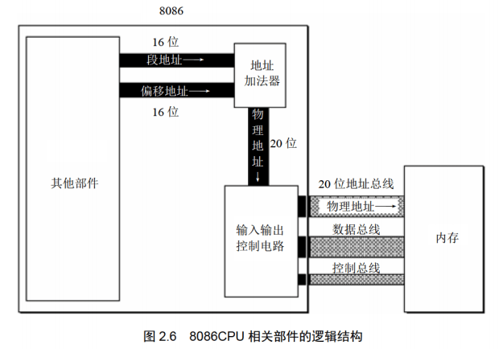  
>如图 2.6 所示， 当 8086CPU 要读写内存时:
(1) CPU 中的相关部件提供两个 16 位的地址， 一个称为段地址， 另一个称为偏移地址；
(2) 段地址和偏移地址通过内部总线送入一个称为地址加法器的部件；
(3) 地址加法器将两个 16 位地址合成为一个 20 位的物理地址；
(4) 地址加法器通过内部总线将 20 位物理地址送入输入输出控制电路；
(5) 输入输出控制电路将 20 位物理地址送上地址总线；
(6) 20 位物理地址被地址总线传送到存储器。

地址加法器采用物理地址=段地址X16+偏移地址的方法用段地址和偏移地址合成物理
地址。其本质为基础地址+偏移地址=物理地址。例如， 8086CPU 要访问地址为 123C8H 的内存单元，此时， 地址加法器的工作过程如图 2.7 所示(图中数据皆为十六进制表示)。
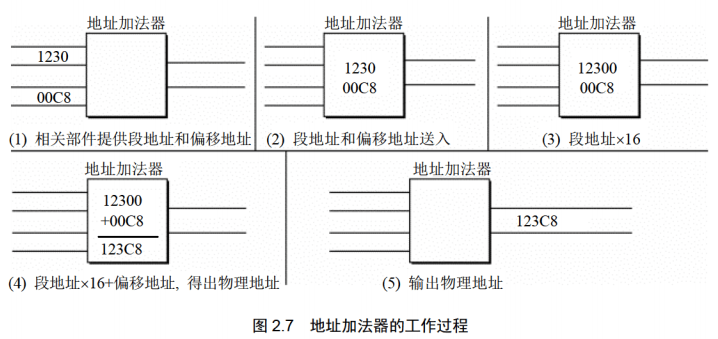  
#### 左移操作和乘法的关系
> (1) 一个数据的二进制形式左移 1 位， 相当于该数据乘以 2;
(2) 一个数据的二进制形式左移 N 位， 相当于该数据乘以 2 的 N 次方；
(3) 地址加法器如何完成段地址x l6 的运算？ 就是将以二进制形式存放的段地址左移 4 位。
**一个 X 进制的数据左移 1 位， 相当于乘以 X。**

#### 段的概念
内存并没有分段， 段的划分来自于 CPU,如图 2.9 所示， 我们可以认为： 地址 10000H 100FFH 的内存单元组成一个段， 该段的起始地址(基础地址)为 10000H， 段地址为 1000H, 大小为 100H； 我们也可以认为地址 10000H 1007FH、 10080H 100FFH 的内存单元组成两个段， 它们的起始地址(基础地址)为： 10000H 和 10080H, 段地址为： 1000H 和 1008H, 大小都为 80H。
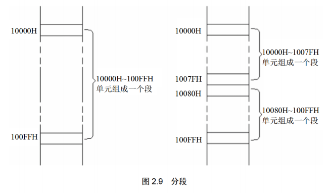  
在编程时可以根据需要， 将若干地址连续的内存单元看作一个段， 用段地址 X16 定位段的起始地址(基础地址)， 用偏移地址定位段中的内存单元。 有两点需要注意： 段地址X16 必然是 16 的倍数， 所以一个段的起始地址也一定是 16 的倍数； 偏移地址为 16 位， 16 位地址的寻址能力为 64KB， 所以一个段的长度最大为 64KB。
CPU 可以用不同的段地址和偏移地址形成同一个物理地址。
#### 监测点2.2
(1)给定段地址为0001H，仅通过变化偏移地址寻址，CPU的寻址范围为（00010H）到（00010H+FFFFH=1000FH）。
(2)有一数据存放在内存20000H单元中，现给定段地址为SA，若想用偏移地址寻到此单元。则SA应满足的条件是:最小为（1000H），最大为（2000H）。
提示，反过来思考一下，当段地址给定为多少，CPU无论怎么变化偏移地址都无法寻到20000H单元?

#### 段寄存器
段地址在 8086CPU 的段寄存器中存放。 8086CPU 有 4 个 段 寄 存 器： CS、 DS、 SS、 ES。 当8086CPU 要访问内存时由这 4 个段寄存器提供内存单元的段地址。 
#### CS和IP
CS 和 IP 是 8086CPU 中两个最关键的寄存器， 它们指示了 CPU 当前要读取指令的地址。 CS 为代码段寄存器， IP 为指令指针寄存器。
在 8086PC 机中， 任意时刻， 设 CS 中的内容为 M， IP 中的内容为 N， 8086CPU 将从内存 Mxl6+N 单元开始， 读取一条指令并执行。即8086 机中， 任意时刻， CPU 将 CS:IP 指向的内容当作指令执行。
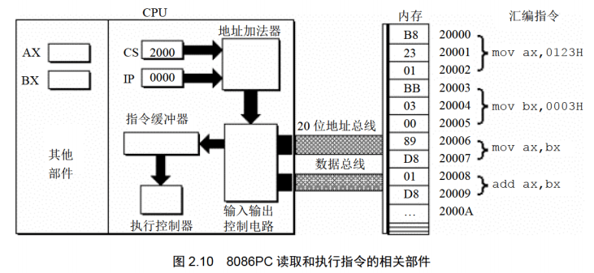  
>图 2.10 说明如下。
(1) 8086CPU 当前状态： CS 中的内容为 2000H， IP 中的内容为 0000H;
(2) 内存 20000H 20009H 单元存放着可执行的机器码；
(3) 内存 20000H 20009H 单元中存放的机器码对应的汇编指令如下。
地址： 20000H 20002H 内容： B8 23 01 长度： 3Byte, 对应汇编指令： movax,0123H
地址： 20003H 20005H 内容： BB 03 00 长度： 3Byte, 对应汇编指令： movbx,0003H
地址： 20006H 20007H, 内容： 89 D8, 长度： 2Byte, 对应汇编指令： mov ax,bx
地址： 20008H 20009H, 内容： 01 D8, 长度： 2Byte, 对应汇编指令： addax,bx

下面的一组图(图 2.11 图 2.19)， 以图 2.10 描述的情况为初始状态， 展示了 8086CPU读取、 执行一条指令的过程。 注意每幅图中发生的变化.
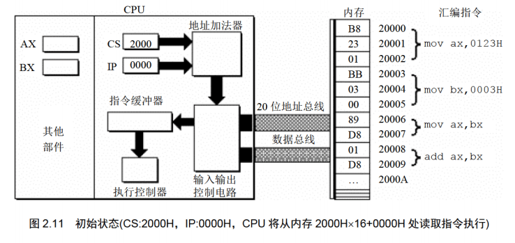  
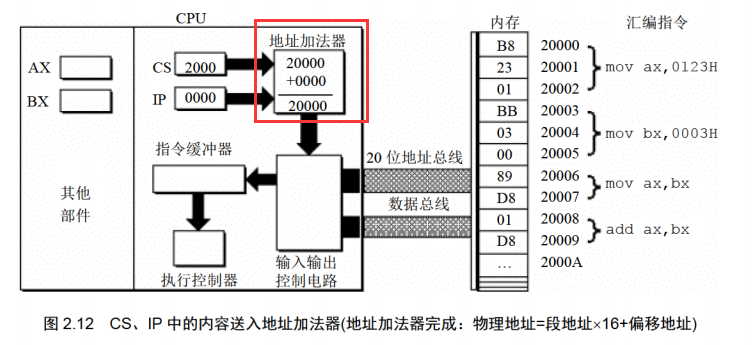  
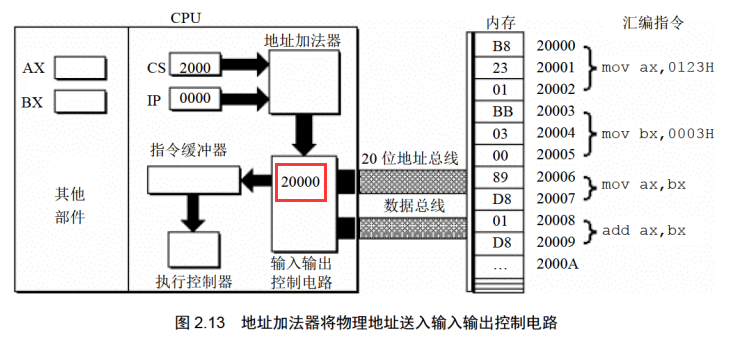  
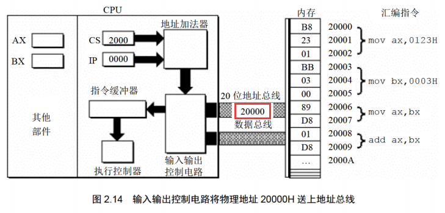  
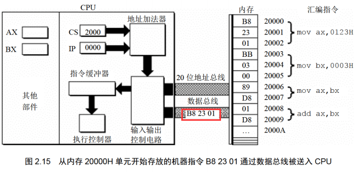  
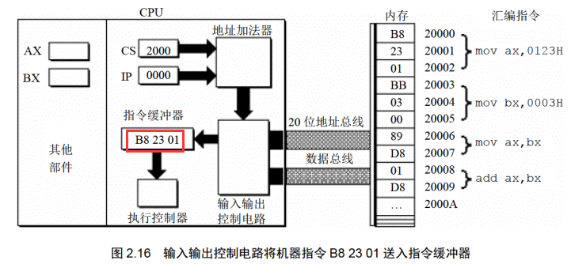  
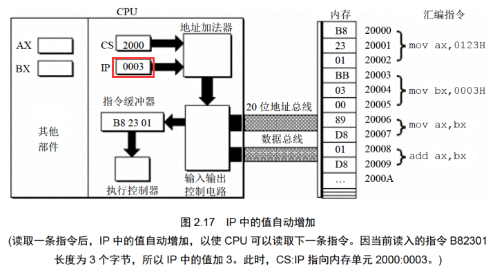  
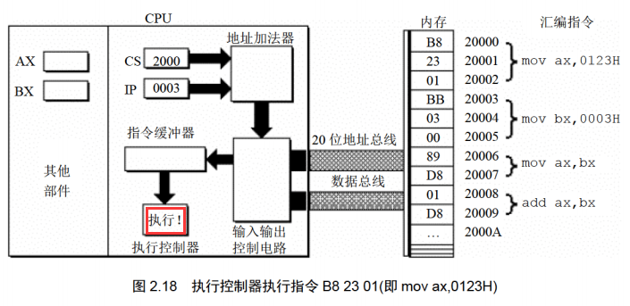  
  
下面的一组图(图2.20~图2.26)，以图2.19的情况为初始状态，展示了8086CPU继续读取、执行3条指令的过程。注意IP的变化(下面的描述中，隐蔽了读取每条指令的细节)。
  
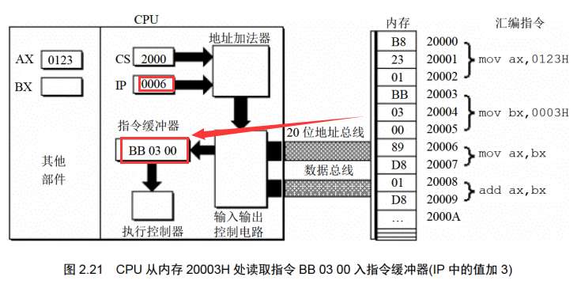  
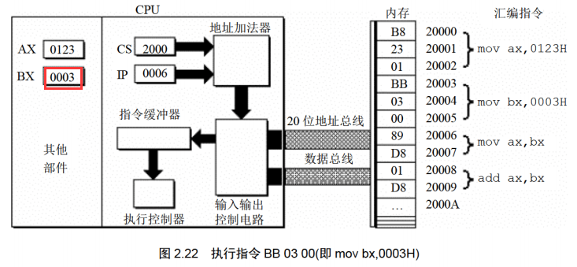  
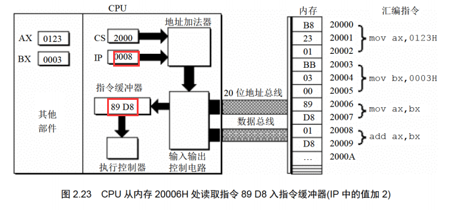  
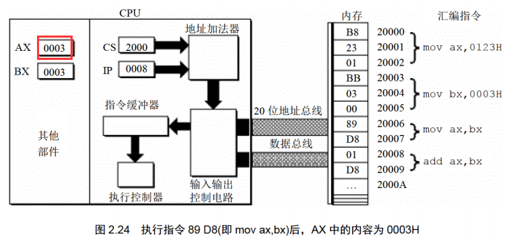  

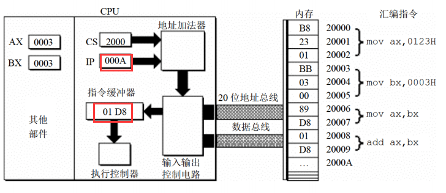  
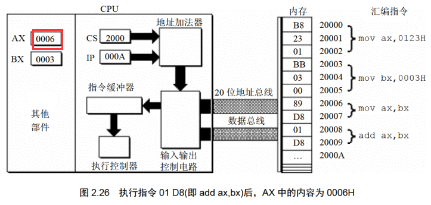  
> 8086cpu的工作过程简述如下：
> (1)从CS:IP指向的内存单元读取指令，读取的指令进入指令缓冲器;
> (2)IP-IP+所读取指令的长度，从而指向下一条指令;
> (3)执行指令。转到步骤(1)，重复这个过程。
在8086CPU加电启动或复位后(即CPU刚开始工作时)CS和IP被设置为CS=FFFFH，IP=0000H，即在8086PC机刚启动时，CPU从内存FFFFOH单元中读取指令执行，FFFFOH单元中的指令是8086PC机开机后执行的第一条指令。
#### 指令长度的确定
来源：https://blog.csdn.net/qq_36499686/article/details/78302165
汇编指令长度与寻址方式有关，规律或原则如下：
一、没有操作数的指令，指令长度为1个字节
二、操作数只涉及寄存器的的指令，指令长度为2个字节
    如：mov bx,ax
三、操作数涉及内存地址的指令，指令长度为3个字节
    如：mov ax,ds:\[bx+si+idata]
四、操作数涉及立即数的指令，指令长度为：寄存器类型+1
    8位寄存器，寄存器类型=1，如：mov al,8；指令长度为2个字节
    16位寄存器，寄存器类型=2，如：mov ax,8；指令长度为3个字节
五、跳转指令，分为2种情况：
1、段内跳转（指令长度为2个字节或3个字节）
jmp指令本身占1个字节
段内短转移，8位位移量占一个字节，加上jmp指令一个字节，整条指令占2个字节
如：jmp short opr
段内近转移，16位位移量占两个字节，加上jmp指令一个字节，整条指令占3个字节
如：jmp near ptr opr
2、段间跳转，指令长度为5个字节
如：jmp dword ptr table[bx][di]
或  jmp far ptr opr
或  jmp dword ptr opr 
注意：形如“jmp 1234:5678”的汇编指令，是在Debug中使用的汇编指令，汇编编译器并不认识，如果在源程序中使用，那么在编译时便会报错。

**在任何时候， CPU 将 CS、 IP 中的内容当作指令的段地址和偏移地址， 用它们合成指令的物理地址， 到内存中读取指令码， 执行。 如果说， 内存中的一段信息曾被 CPU 执行过的话， 那么， 它所在的内存单元必然被 CS:IP 指向过。**

#### 修改CS和IP的值
程序员通过改变CS和IP的内容，来控制CPU执行目标的指令。
传送指令mov无法修改CS和IP的值，只能通过转移指令进行修改，如jmp指令。
jmp语法如下：jmp 段地址:偏移地址。用指令中给出的段地址修改CS，偏移地址修改IP。
示例：
jmp 2AE3:3，执行后:CS=2AE3H，IP=0003H，CPU将从2AE33H 处读取指令。
jmp 3:0B16，执行后:CS=0003H，IP-OB16H，CPU将从00B46H 处读取指令。

若想仅修改 IP 的内容， 可用形如 “jmp 某一合法寄存器” 的指令完成，用寄存器中的值修改 IP。如：
jmp ax，指令执行前: ax=1000H，CS=2000H，IP=0003H
        指令执行后: ax=1000H，CS=2000H，IP=1000H
jmp bx，指令执行前: bx=0B16H，CS=2000H，IP=0003H
        指令执行后: bx=0B16H，CS=2000H，IP=0B16H
jmp ax和mov IP,ax含义一致，但后者不是合法语句。
通过jmp跳转之后，cpu会从挑战后的地方继续执行。示例：
>内存中存放的机器码和对应的汇编指令情况如图 2.27 所示， 设 CPU 初始状态:CS=2000H, IP=0000H, 执行序列为：
(1) mov ax,6622H
(2) jmp 1000:3
(3) mov ax,0000
(4) mov bx,ax
(5) jmp bx
(6) mov ax,0123H
(7)转到第3步执行
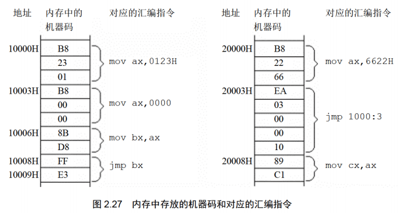  

#### 代码段
可以人为的将长度为 N(N<64KB)的一组代码， 存在一组地址连续、 起始地址为 16 的倍数的内存单元中，将其看做代码段。
**将一段内存当作代码段， 仅仅是我们在编程时的一种安排， CPU 并不会由于这种安排， 就自动地将我们定义的代码段中的指令当作指令来执行。 CPU 只认被 CS:IP 指向的内存单元中的内容为指令。 所以， 要让 CPU 执行我们放在代码段中的指令， 必须要将 CS:IP 指向所定义的代码段中的第一条指令的首地址。**

#### 小结
(1)段地址在8086CPU 的段寄存器中存放。当8086CPU要访问内存时，由段寄存器提供内存单元的段地址。8086CPU有4个段寄存器，其中CS用来存放指令的段地址。
(2)CS存放指令的段地址，IP存放指令的偏移地址。
8086机中，任意时刻，CPU将CS:IP指向的内容当作指令执行。
(3)8086CPU的工作过程:
1. 从CS:IP指向的内存单元读取指令，读取的指令进入指令缓冲器;
2. IP指向下一条指令;
3. 执行指令。(转到步骤1，重复这个过程。)
4. 8086CPU提供转移指令修改CS、IP的内容。
#### 监测点2.3
下面的3条指令执行后，CPU几次修改IP?都是在什么时候?最后IP中的值是多少?
mov ax,bx
sub ax,ax
jmp ax
备注：sub是减法指令，上面那句等效于于c语言ax=ax-bx。
答：3次。执行一条语句，修改一次，共修改2次，最后jmp单独修改一次。共三次。
### 实验1：查看cpu和内存，用机器指令和汇编指令编程
