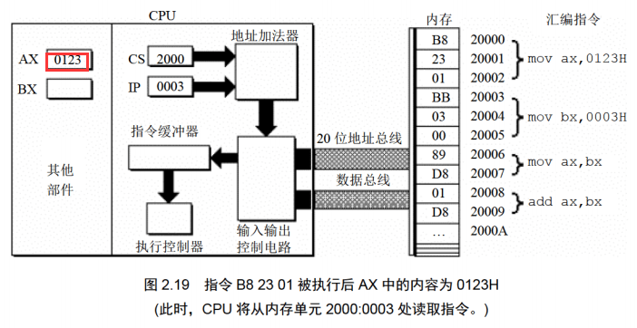
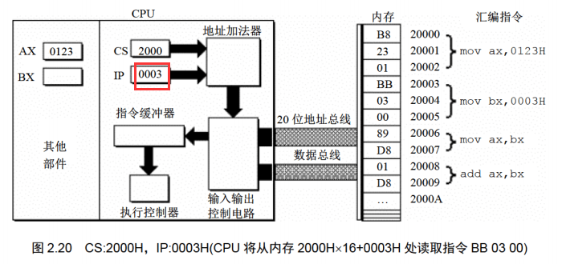

**①没有通过检测点不要向下学习； ②没有完成当前的实验不要向下学习**
## 第一章 基础知识
**学习目的：汇编课程的研宄重点放在如何利用硬件系统的编程结构和指令集有效灵活地控制系统进行工作。**
存储器被划分成多个存储单元， 存储单元从零开始顺序编号。 这些编号可以看作存储单元在存储器中的地址。  
cpu和其他芯片通过总线连接，总线从逻辑上可分为：地址总线、控制总线和数据总线。  
CPU 从 3 号单元中读取数据的过程(见图 1.3)如下。

>读一次数据需要三条总线共同完成：
(1) CPU 通过地址线将地址信息 3 发出。
(2) CPU 通过控制线发出内存读命令， 选中存储器芯片， 并通知它， 将要从中读取数据
(3) 存储器将 3 号单元中的数据 8 通过数据线送入 CPU。

一个 CPU 有 N根地址线， 则可以说这个CPU的地址总线的宽度为N。 这样的 CPU最多可以寻找2的N次方个内存单元。
数据总线的宽度决定了 CPU 和外界的数据传送速度。 8 根数据总线一次可传送一个 8 位二进制数据(即一个字节)。 16 根数据总线一次可传送两个字节。
控制总线是一些不同控制线的集合。 有多少根控制总线， 就意味着 CPU 提供了对外部器件的多少种控制。 所以， 控制总线的宽度决定了 CPU 对外部器件的控制能力。
#### 1.1~1.10小结
>(1) 汇编指令是机器指令的助记符， 同机器指令一一对应。
(2) 每一种 CPU 都有自己的汇编指令集。
(3) CPU 可以直接使用的信息在存储器中存放。
(4) 在存储器中指令和数据没有任何区别， 都是二进制信息。
(5) 存储单元从零开始顺序编号。
(6) —个存储单元可以存储8个bit，即8位二进制数。
(7) lByte=8bit 1KB=1024B 1MB=1024KB 1GB=1024MB。
(8) 每一个 CPU 芯片都有许多管脚， 这些管脚和总线相连。也可以说，这些管脚引出总线。 一个CPU 可以引出 3 种总线的宽度标志了这个 CPU 的不同方面的性能：
地址总线的宽度决定了 CPU 的寻址能力；
数据总线的宽度决定了 CPU 与其他器件进行数据传送时的一次数据传送量;
控制总线的宽度决定了 CPU 对系统中其他器件的控制能力。

#### 监测点1.1
>(1) 1个CPU的寻址能力为8KB，那么它的地址总线的宽度为(13).
(2)1KB的存储器有(1024)个存储单元。存储单元的编号从(0)到(1023).
(3)lKB的存储器可以存储(1024*8)个bit，(1024)个Byte。
(4)1GB、1MB、1KB分别是(1024\*1024\*1024,1024\*1024,1024)Byte.
(5) 8080、8088、80286、80386的地址总线宽度分别为l6 根、20 根、24根、32根，则它们的寻址能力分别为:(2^6)(KB)、(1)(MB)、(2^4)(MB)、(2^2)(GB)。
(6) 8080、8088、8086、80286、80386的数据总线宽度分别为8根、8根、16根、16根、32根。则它们一次可以传送的数据为:(1)(B)、(1)(B)、(2)(B)、(2)(B)、(4)(B)。
(7)从内存中读取1024字节的数据，8086至少要读(512)次，80386至少要读(256)次。
(8)在存储器中，数据和程序以(二进制)形式存放。

存储芯片从读写属性上可分为两类：随机存储器(RAM)和只读存储器(ROM)。
图 1.7 展示了 PC 系统中各类存储器的逻辑连接情况。
  
CPU 在操控上述存储器的时候， 把它们都当作内存来对待， 把它们总的看作
一个由若干存储单元组成的逻辑存储器， 这个逻辑存储器就是我们所说的内存地址空间。
图 1.8 展示了 CPU 将系统中各类存储器看作一个逻辑存储器的情况。
  
在图 1.8 中， 所有的物理存储器被看作一个由若干存储单元组成的逻辑存储器， 每个物理存储器在这个逻辑存储器中占有一个地址段， 即一段地址空间。 CPU 在这段地址空间中读写数据， 实际上就是在相对应的物理存储器中读写数据。

不同的计算机系统的内存地址空间的分配情况是不同的， 图 1.9 展示了 8086PC 机内存地址空间分配的基本情况。
  

## 第二章 寄存器
#### 通用寄存器
AX、 BX、 CX、 DX 这4个寄存器通常用来存放一般性的数据，被称为通用寄存器。其都可以分解为两个8位寄存器来使用。
  
  
**在以后的课程中， 为了区分不同的进制， 在十六进制表示的数据的后面加 H， 在二进制表示的数据后面加 B， 十进制表示的数据后面什么也不加。**
**在写一条汇编指令或一个寄存器的名称时不区分大小写。**
**在进行数据传送或运算时， 要注意指令的两个操作对象的位数应当是一致的。即8位寄存器对8位寄存器，16位对16位。**
>汇编加法导致溢出的情况：若超过寄存器位数限制，高位直接抛弃。
示例1：程序段中的最后一条指令 add ax,bx， 在执行前 ax 和 bx 中的数据都为 8226H， 相加后所得的值为： 1044CH， 但是 ax 为 16 位寄存器， 只能存放 4 位十六进制的数据， 所以最高位的1不能在ax中保存，ax中的数据为:044CH。
示例2：程序段中的最后一条指令 add al,93H, 在执行前， al 中的数据为 C5H， 相加后所得的值为： 158H, 但是 al 为 8 位寄存器， 只能存放两位十六进制的数据， 所以最高位的 1 丢失，ax中的数据为： 0058H。这种情况下，al作为一个独立的8为寄存器来使用，和ah没有关系，cpu在执行这条指令时认为ah和al是两个不相关的寄存器。

#### 监测点2.1（第一题略过）
>（2）只能使用目前学过的汇编指令， 最多使用 4 条指令， 编程计算 2 的 4 次方。
```bash
add ax, 2
add ax, 2
add ax, 2
add ax, 2
```
#### 16位结构的cpu
>运算器一次最多可以处理 16 位的数据
寄存器的最大宽度为 16 位；
寄存器和运算器之间的通路为 16 位。
#### 8086cpu给出物理地址的方法
8086CPU 有 20 位地址总线， 可以传送20位地址，达到1MB寻址能力。8086CPU 采用一种在内部用两个 16 位地址合成的方法来形成一个 20 位的物理地址。
  
>如图 2.6 所示， 当 8086CPU 要读写内存时:
(1) CPU 中的相关部件提供两个 16 位的地址， 一个称为段地址， 另一个称为偏移地址；
(2) 段地址和偏移地址通过内部总线送入一个称为地址加法器的部件；
(3) 地址加法器将两个 16 位地址合成为一个 20 位的物理地址；
(4) 地址加法器通过内部总线将 20 位物理地址送入输入输出控制电路；
(5) 输入输出控制电路将 20 位物理地址送上地址总线；
(6) 20 位物理地址被地址总线传送到存储器。

地址加法器采用物理地址=段地址X16+偏移地址的方法用段地址和偏移地址合成物理
地址。其本质为基础地址+偏移地址=物理地址。例如， 8086CPU 要访问地址为 123C8H 的内存单元，此时， 地址加法器的工作过程如图 2.7 所示(图中数据皆为十六进制表示)。
  
#### 左移操作和乘法的关系
> (1) 一个数据的二进制形式左移 1 位， 相当于该数据乘以 2;
(2) 一个数据的二进制形式左移 N 位， 相当于该数据乘以 2 的 N 次方；
(3) 地址加法器如何完成段地址x l6 的运算？ 就是将以二进制形式存放的段地址左移 4 位。
**一个 X 进制的数据左移 1 位， 相当于乘以 X。**

#### 段的概念
内存并没有分段， 段的划分来自于 CPU,如图 2.9 所示， 我们可以认为： 地址 10000H 100FFH 的内存单元组成一个段， 该段的起始地址(基础地址)为 10000H， 段地址为 1000H, 大小为 100H； 我们也可以认为地址 10000H 1007FH、 10080H 100FFH 的内存单元组成两个段， 它们的起始地址(基础地址)为： 10000H 和 10080H, 段地址为： 1000H 和 1008H, 大小都为 80H。
  
在编程时可以根据需要， 将若干地址连续的内存单元看作一个段， 用段地址 X16 定位段的起始地址(基础地址)， 用偏移地址定位段中的内存单元。 有两点需要注意： 段地址X16 必然是 16 的倍数， 所以一个段的起始地址也一定是 16 的倍数； 偏移地址为 16 位， 16 位地址的寻址能力为 64KB， 所以一个段的长度最大为 64KB。
CPU 可以用不同的段地址和偏移地址形成同一个物理地址。
#### 监测点2.2
(1)给定段地址为0001H，仅通过变化偏移地址寻址，CPU的寻址范围为（00010H）到（00010H+FFFFH=1000FH）。
(2)有一数据存放在内存20000H单元中，现给定段地址为SA，若想用偏移地址寻到此单元。则SA应满足的条件是:最小为（1000H），最大为（2000H）。
提示，反过来思考一下，当段地址给定为多少，CPU无论怎么变化偏移地址都无法寻到20000H单元?

#### 段寄存器
段地址在 8086CPU 的段寄存器中存放。 8086CPU 有 4 个 段 寄 存 器： CS、 DS、 SS、 ES。 当8086CPU 要访问内存时由这 4 个段寄存器提供内存单元的段地址。 
#### CS和IP
CS 和 IP 是 8086CPU 中两个最关键的寄存器， 它们指示了 CPU 当前要读取指令的地址。 CS 为代码段寄存器， IP 为指令指针寄存器。
在 8086PC 机中， 任意时刻， 设 CS 中的内容为 M， IP 中的内容为 N， 8086CPU 将从内存 Mxl6+N 单元开始， 读取一条指令并执行。即8086 机中， 任意时刻， CPU 将 CS:IP 指向的内容当作指令执行。
  
>图 2.10 说明如下。
(1) 8086CPU 当前状态： CS 中的内容为 2000H， IP 中的内容为 0000H;
(2) 内存 20000H 20009H 单元存放着可执行的机器码；
(3) 内存 20000H 20009H 单元中存放的机器码对应的汇编指令如下。
地址： 20000H 20002H 内容： B8 23 01 长度： 3Byte, 对应汇编指令： movax,0123H
地址： 20003H 20005H 内容： BB 03 00 长度： 3Byte, 对应汇编指令： movbx,0003H
地址： 20006H 20007H, 内容： 89 D8, 长度： 2Byte, 对应汇编指令： mov ax,bx
地址： 20008H 20009H, 内容： 01 D8, 长度： 2Byte, 对应汇编指令： addax,bx

下面的一组图(图 2.11 图 2.19)， 以图 2.10 描述的情况为初始状态， 展示了 8086CPU读取、 执行一条指令的过程。 注意每幅图中发生的变化.
  
  
  
  
  
  
  
  
  
下面的一组图(图2.20~图2.26)，以图2.19的情况为初始状态，展示了8086CPU继续读取、执行3条指令的过程。注意IP的变化(下面的描述中，隐蔽了读取每条指令的细节)。
  
  
  
  
  

  
  
> 8086cpu的工作过程简述如下：
> (1)从CS:IP指向的内存单元读取指令，读取的指令进入指令缓冲器;
> (2)IP-IP+所读取指令的长度，从而指向下一条指令;
> (3)执行指令。转到步骤(1)，重复这个过程。
在8086CPU加电启动或复位后(即CPU刚开始工作时)CS和IP被设置为CS=FFFFH，IP=0000H，即在8086PC机刚启动时，CPU从内存FFFFOH单元中读取指令执行，FFFFOH单元中的指令是8086PC机开机后执行的第一条指令。
#### 指令长度的确定
来源：https://blog.csdn.net/qq_36499686/article/details/78302165
汇编指令长度与寻址方式有关，规律或原则如下：
一、没有操作数的指令，指令长度为1个字节
二、操作数只涉及寄存器的的指令，指令长度为2个字节
    如：mov bx,ax
三、操作数涉及内存地址的指令，指令长度为3个字节
    如：mov ax,ds:\[bx+si+idata]
四、操作数涉及立即数的指令，指令长度为：寄存器类型+1
    8位寄存器，寄存器类型=1，如：mov al,8；指令长度为2个字节
    16位寄存器，寄存器类型=2，如：mov ax,8；指令长度为3个字节
五、跳转指令，分为2种情况：
1、段内跳转（指令长度为2个字节或3个字节）
jmp指令本身占1个字节
段内短转移，8位位移量占一个字节，加上jmp指令一个字节，整条指令占2个字节
如：jmp short opr
段内近转移，16位位移量占两个字节，加上jmp指令一个字节，整条指令占3个字节
如：jmp near ptr opr
2、段间跳转，指令长度为5个字节
如：jmp dword ptr table[bx][di]
或  jmp far ptr opr
或  jmp dword ptr opr 
注意：形如“jmp 1234:5678”的汇编指令，是在Debug中使用的汇编指令，汇编编译器并不认识，如果在源程序中使用，那么在编译时便会报错。

**在任何时候， CPU 将 CS、 IP 中的内容当作指令的段地址和偏移地址， 用它们合成指令的物理地址， 到内存中读取指令码， 执行。 如果说， 内存中的一段信息曾被 CPU 执行过的话， 那么， 它所在的内存单元必然被 CS:IP 指向过。**

#### 修改CS和IP的值
程序员通过改变CS和IP的内容，来控制CPU执行目标的指令。
传送指令mov无法修改CS和IP的值，只能通过转移指令进行修改，如jmp指令。
jmp语法如下：jmp 段地址:偏移地址。用指令中给出的段地址修改CS，偏移地址修改IP。
示例：
jmp 2AE3:3，执行后:CS=2AE3H，IP=0003H，CPU将从2AE33H 处读取指令。
jmp 3:0B16，执行后:CS=0003H，IP-OB16H，CPU将从00B46H 处读取指令。

若想仅修改 IP 的内容， 可用形如 “jmp 某一合法寄存器” 的指令完成，用寄存器中的值修改 IP。如：
jmp ax，指令执行前: ax=1000H，CS=2000H，IP=0003H
        指令执行后: ax=1000H，CS=2000H，IP=1000H
jmp bx，指令执行前: bx=0B16H，CS=2000H，IP=0003H
        指令执行后: bx=0B16H，CS=2000H，IP=0B16H
jmp ax和mov IP,ax含义一致，但后者不是合法语句。
通过jmp跳转之后，cpu会从挑战后的地方继续执行。示例：
>内存中存放的机器码和对应的汇编指令情况如图 2.27 所示， 设 CPU 初始状态:CS=2000H, IP=0000H, 执行序列为：
(1) mov ax,6622H
(2) jmp 1000:3
(3) mov ax,0000
(4) mov bx,ax
(5) jmp bx
(6) mov ax,0123H
(7)转到第3步执行
  

#### 代码段
可以人为的将长度为 N(N<64KB)的一组代码， 存在一组地址连续、 起始地址为 16 的倍数的内存单元中，将其看做代码段。
**将一段内存当作代码段， 仅仅是我们在编程时的一种安排， CPU 并不会由于这种安排， 就自动地将我们定义的代码段中的指令当作指令来执行。 CPU 只认被 CS:IP 指向的内存单元中的内容为指令。 所以， 要让 CPU 执行我们放在代码段中的指令， 必须要将 CS:IP 指向所定义的代码段中的第一条指令的首地址。**

#### 小结
(1)段地址在8086CPU 的段寄存器中存放。当8086CPU要访问内存时，由段寄存器提供内存单元的段地址。8086CPU有4个段寄存器，其中CS用来存放指令的段地址。
(2)CS存放指令的段地址，IP存放指令的偏移地址。
8086机中，任意时刻，CPU将CS:IP指向的内容当作指令执行。
(3)8086CPU的工作过程:
1. 从CS:IP指向的内存单元读取指令，读取的指令进入指令缓冲器;
2. IP指向下一条指令;
3. 执行指令。(转到步骤1，重复这个过程。)
4. 8086CPU提供转移指令修改CS、IP的内容。
#### 监测点2.3
下面的3条指令执行后，CPU几次修改IP?都是在什么时候?最后IP中的值是多少?
mov ax,bx
sub ax,ax
jmp ax
备注：sub是减法指令，上面那句等效于于c语言ax=ax-bx。
答：3次。执行一条语句，修改一次，共修改2次，最后jmp单独修改一次。共三次。
### 实验1：查看cpu和内存，用机器指令和汇编指令编程
#### 预备知识： Debug 的使用

>环境说明：
win10无法执行debug命令，作者书中使用的系统为win2000，本人使用winxp虚拟机，可以正常运行debug，但现实和作者的win2000有所出入。winxp下进入debug方法如下：
cmd窗口中输入debug，回车即可。
  


>常用命令
用Debug 的R命令查看、改变CPU寄存器的内容;`-r`, `-r ax`
用Debug 的D命令查看内存中的内容;`d 段地址:偏移地址` `-d 1000:0` 
用Debug 的E命令改写内存中的内容; 
  
用Debug 的U命令将内存中的机器指令翻译成汇编指令;
 
用Debug 的T命令执行一条机器指令;
  
用Debug 的A命令以汇编指令的格式在内存中写入一条机器指令。
  
用Debug 的Q命令退出debug。

  
实验结果：https://blog.csdn.net/OrangeHap/article/details/89790492
## 第三章 寄存器
字单元，即存放一个字型数据(16 位)的内存单元， 由两个地址连续的内存单元组成。 高地址内存单元中存放字型数据的高位字节， 低地址内存单元中存放字型数据的低位字节。
任何两个地址连续的内存单元， N 号单元和 N+1 号 单
元， 可以将它们看成两个内存单元， 也可看成一个地址为 N 的字单元中的高位字节单元和低位字节单元。
#### DS和[](address)
在 8086PC 中，内存地址由段地址和偏移地址组成。 8086CPU 中有一个 DS 寄存器， 通常用来存放要访问数据的段地址。 
```bash
mov al, [0]
# 0为偏移地址，指令执行时， 8086CPU 自动取 ds 中的数据为内存单元的段地址。
```
8086CPU 不支持将数据直接送入段寄存器的操作， ds 是一个段寄存器， 所以move ds，1000H 这条指令是非法的。只好用一个寄存器来进行中转， 即先将 1000H 送入一个一般的寄存器， 如 bx， 再将 bx 中的内容送入 ds。
只要在mov 指令中给出 16 位的寄存器就可以进行 16 位数据的传送了。比如:
```bash
mov bx, 1000H
mov ds, bx
mov ax, [0] ; 1000:0处的字型数据送入ax
mov [0], cx ; cx中的16为数据送到1000：0处
```
#### mov, add, sub指令
mov 寄存器，数据 比如：mov ax, 8
mov 寄存器，寄存器 比如：mov ax, bx
mov 寄存器，内存单元 比如:mov ax, [0]
mov 内存单元，寄存器 比如:mov [0], ax
mov 段寄存器，寄存器 比如：mov ds, ax

add 寄存器，数据 比如：add ax, 8
add 寄存器，寄存器 比如：add ax, bx
add 寄存器，内存单元 比如:add ax, [0]
add 内存单元，寄存器 比如:add [0], ax

sub 寄存器，数据 比如：sub ax, 8
sub 寄存器，寄存器 比如：sub ax, bx
sub 寄存器，内存单元 比如:sub ax, [0]
sub 内存单元，寄存器 比如:sub [0], ax

数据段和代码段定义类似，只不过存储的为数据。
下面代码实现累加数据段前3个字型数据：
```bash
mov ax,1000
mov ds,ax
mov ax,0
add ax,[0]
add ax,[2]
add ax,[4]
```
#### 小结
>(1) 字在内存中存储时， 要用两个地址连续的内存单元来存放， 字的低位字节存放在低地址单元中，高位字节存放在高地址单元中。
(2) 用 mov 指令访问内存单元， 可以在 mov 指令中只给出单元的偏移地址， 此时， 段地址默认在DS 寄存器中。
(3)[address]表示一个偏移地址为 address 的内存单元。
(4) 在内存和寄存器之间传送字型数据时， 高地址单元和高 8 位寄存器、 低地址单元和低 8 位寄存器相对应。
(5)mov、 add、 sub 是具有两个操作对象的指令。 jmp 是具有一个操作对象的指令。
(6) 可以根据自己的推测， 在 Debug 中实验指令的新格式。
#### cpu提供的栈机制
8086CPU 提供入栈和出栈指令， 最基本的两个是 PUSH(入栈） 和 POP(出栈)。 比如， push ax 表示将寄存器 ax 中的数据送入栈中， pop ax 表示从栈顶取出数据送入8086CPU 的入栈和出栈操作都是以字为单位进行的。
 8086CPU 中， 有两个寄存器， 段寄存器 SS 和寄存器 SP， 栈顶的段地址存放在 SS 中， 偏移地址存放在 SP 中。 任意时刻， SS:SP 指向栈顶元素。 push 指令和 pop 指令执行时， CPU 从 SS 和 SP 中得到栈顶的地址。

>push ax的执行，由以下两步完成：
(1) SP=SP-2, SS:SP 指向当前栈顶前面的单元， 以当前栈顶前面的单元为新的栈顶;
(2) 将 ax 中的内容送入 SS:SP 指向的内存单元处， SS:SP 此时指向新栈顶。

  

栈空的状态：
任意时刻， SS:SP 指向栈顶元素， 当栈为空的时候， 栈中没有元素，也就不存在栈顶元素， 所以 SS:SP 只能指向栈的最底部单元下面的单元， 该单元的偏移地址为栈最底部的字单元的偏移地址+2, 栈最底部字单元的地址为1000:000E, 所以栈空时， SP=0010H。
  
>pop ax的执行过程和push ax刚好相反，由以下两步完成：
(1) 将 SS:SP 指向的内存单元处的数据送入 ax 中；
(2) SP=SP+2, SS:SP 指向当前栈顶下面的单元， 以当前栈顶下面的单元为新的栈顶。

  
**出栈后， SS:SP 指向新的栈顶 1000EH， pop 操作前的栈顶元素，1000CH 处的 2266H 依然存在， 但是， 它己不在栈中。 当再次执行 push 等入栈指令后，SS:SP 移至 1000CH， 并在里面写入新的数据， 它将被覆盖。**

当栈满的时候再使用 push 指令入栈， 或栈空的时候再使用 pop 指令出栈， 都将发生栈顶超界问题。
8086CPU 不保证我们对栈的操作不会超界。因而需要程序员自己注意，避免越界。

>push和pop支持的操作：
push 寄存器; 将一个寄存器中的数据入栈
pop 寄存器; 出栈，用一个寄存器接受出栈的数据
push 段寄存器; 将一个段寄存器中的数据入栈
pop 段寄存器; 出栈，用一个段寄存器接受出栈的数据
push 内存单元; 将一个内存字单元处的字入栈（注意：栈操作都是以字为单位）
pop 内存单元; 出栈，用一个内存字单元接受出栈的数据

#### 栈的综述
>(1)8086CPU 提供了栈操作机制， 方案如下。
在 SS、 SP 中存放栈顶的段地址和偏移地址;
提供入栈和出栈指令， 它们根据 SS:SP 指示的地址， 按照栈的方式访问内存单元。
(2) push 指令的执行步骤： ①SP=SP-2; ②向 SS:SP 指向的字单元中送入数据。
(3) pop 指令的执行步骤： ①从 SS:SP 指向的字单元中读取数据； ②SP=SP+2。
(4) 任意时刻， SS:SP 指向桟顶元素。
(5) 8086CPU 只记录栈顶， 栈空间的大小我们要自己管理。
(6) 用栈来暂存以后需要恢复的寄存器的内容时， 寄存器出栈的顺序要和入栈的顺序相反。
(7) push, pop 实质上是一种内存传送指令， 注意它们的灵活应用。
栈是一种非常重要的机制， 一定要深入理解， 灵活掌握.

从栈操作指令所完成的功能的角度上来看， push, pop 等指令在执行的时候只修改 SP， 所以栈顶的变化范围是 0-FFFFH .从栈空时候的SP=0，一直压栈，直到栈满时SP=0；如果再次压栈，栈顶将环绕，覆盖了原来栈中的内容。所以一个栈段的容量最大为64k。
#### 段的综述
我们可以将一段内存定义为一个段， 用一个段地址指示段， 用偏移地址访问段内的单元。 这完全是我们自己的安排。
>我们可以用一个段存放数据， 将它定义为“ 数据段”
我们可以用一个段存放代码， 将它定义为“ 代码段”
我们可以用一个段当作栈， 将它定义为“ 栈段” 。
我们可以这样安排， 但若要让 CPU 按照我们的安排来访问这些段， 就要:
对于数据段， 将它的段地址放在 DS 中， 用mov，add,sub等访问内存单元的指令时，cpu就将我们定义的数据段中的内容当作数据来访问；
对于代码段， 将它的段地址放在 CS 中， 将段中第一条指令的偏移地址放在 IP 中， 这样 CPU 就将执行我们定义的代码段中的指令；
对于栈段， 将它的段地址放在 SS 中， 将栈顶单元的偏移地址放在 SP 中， 这样 CPU 在需要进行栈操作的时候， 比如执行 push、 pop 指令等， 就将我们定义的栈段当作栈空间来用

## 第一个程序
图4.1描述了一个汇编语言从程序写出到最终执行的简要过程，具体说明如下：
  
>第一步：编写汇编源程序
使用文本编辑器(如 Edit、 记事本等)， 用汇编语言编写汇编源程序。
第二步：对源程序进行编译连接
使用汇编语言编译程序对源程序文件中的源程序进行编译， 产生目标文件； 再用连接程序对目标文件进行连接， 生成可在操作系统中直接运行的可执行文件。可执行文件包含两部分：
（1）程序（从源程序中的汇编指令翻译过来的机器码）和数据（源程序中定义的数据）
（2）相关的描述信息（比如，程序有多大、要占用多少内存空间等）
第三步：执行可执行文件中的程序。
操作系统依照可执行文件中的描述信息， 将可执行文件中的机器码和数据加载入内存， 并进行相关的初始化(比如设置 CS:IP 指向第一条要执行的指令)， 然后由 CPU 执行程序。
#### 源程序
```bash
assume cs:codesg
codesg segment

    mov ax, 0123H
    mov bx, 0456H
    add ax, bx
    add ax, ax

    mov ax, 4c00H
    int 21H
codesg ends
end
```
在汇编语言源程序中， 包含两种指令， 一种是汇编指令， 一种是伪指令。 汇编指令是有对应的机器码的指令， 可以被编译为机器指令， 最终为 CPU 所执行。 而伪指令没有对应的机器指令， 最终不被 CPU 所执行。
##### 伪指令
上述代码中的伪指令：
(1)段标识
segment 和 ends 是一对成对使用的伪指令， 这是在写可被编译器编译的汇编程序时，必须要用到的一对伪指令。 segment 和 ends 的功能是定义一个段， segment 说明一个段开始， ends 说明一个段结束。 一个段必须有一个名称来标识， 使用格式为：
```asm
段名 segment
段名 ends
```
一个汇编程序是由多个段组成的， 这些段被用来存放代码、 数据或当作找空间来使用。 我们在前面的课程中所讲解的段的概念， 在汇编源程序中得到了应用与体现， 一个源程序中所有将被计算机所处理的信息： 指令、 数据、 栈， 被划分到了不同的段中。
(2)结束标记
end 是一个汇编程序的结束标记， 编译器在编译汇编程序的过程中， 如果碰到了伪指令 end， 就结束对源程序的编译。 
(3)assume
这 条 伪 指 令 的 含 义 为“ 假 设 ” 。 它 假 设 某 一 段 寄 存 器 和 程 序 中 的 某 一 个 用
segment...ends 定义的段相关联。 通过assume说明这种关联，在需要的情况下， 编译程序可以将段寄存器和某一个具体的段相联系。
##### 程序
将源程序中最终由计算机执行、 处理的指令或数据， 称为程序。 程序最先以汇编指令的形式存在源程序中， 经编译、连接后转变为机器码， 存储在可执行文件中。
  

##### 标号
汇编源程序中， 除了汇编指令和伪指令外， 还有一些标号， 比如 “codesg” 。 一个标号指代了一个地址。 
  
#### 汇编程序从写出到执行的过程
  

#### DOS系统中.exe文件的程序加载过程
  

## 第5章 [BX]和loop指令
[bx]同样也表示一个内存单元， 它的偏移地址在 bx 中， 比如下面的指令：
mov ax,[bx]
将一个内存单元的内容送入 ax, 这个内存单元的长度为 2 字节(字单元)， 存放一个字， 偏移地址在 bx 中， 段地址在 ds 中。
#### 符号约定
为了描述上的简洁， 在以后的课程中， 我们将使用一个描述性的符号 “()” 来表示一个寄存器或一个内存单元中的内容。如：(ax)表示ax中的内容，(al)表示al中的内容。
“()” 中的元素可以有 3 种类型： ①寄存器名； ②段寄存器名； ③内存单元的物理地址(一个 20 位数据)。其中到底是字节型还是字类型，由寄存器名和具体的运算决定。
 idata 表示常量，如：
mov ax,[idata]就代表mov ax,[1]、mov ax,[2]、mov ax,[3]等。
mov bx,idata就代表mov bx,1、mov bx,2、mov bx,3等。

loop指令的格式是:loop 标号，CPU执行 loop 指令的时候，要进行两步操作，
①(cx)=(cx)-1;②判断 cx 中的值，不为零则转至标号处执行程序，如果为零则向下执行。通常用loop 指令来实现循环功能， CX 中存放循环次数。
```ams
;计算2^11次方
assume cs:code
code segment
    mov ax, 2
    mov cx, 11
s:  add ax, ax
    loop s

    mov ax, 4c00h
    int 21h
code ends
end
```
>用 cx 和 loop 指令相配合实现循环功能的 3 个要点:
(1)在cx 中存放循环次数;
(2) loop 指令中的标号所标识地址要在前面;
(3)要循环执行的程序段，要写在标号和 loop指令的中间。
程序框架如下：
```asm
    mov cx, 循环次数
s:
    循环执行的程序段
    loop s
```
**在汇编源程序中， 数据不能以字母开头， 所以要在前面加 0.**
debug程序可以用-g来让其执行到指定位置。如g 0012b,表示执行程序到当前代码段(段地址在 CS 中)的 0012h 处.
我们希望将循环一次执行完。 可以使用 p 命令来达到目的。 再次遇到loop 指令时， 使用 p 命令来执行， Debug 就会自动重复执行循环中的指令， 直到(cx)=0 为止。 

>编译器masm和debug的一点小不同：
(1)在汇编源程序中，如果用指令访问一个内存单元，则在指令中必须用“[...]”来表示内存单元，如果在“[”里用一个常量idata直接给出内存单元的偏移地址，就要在“[”的前面显式地给出段地址所在的段寄存器。比如
mov al,ds:[0]
如果没有在“]”的前面显式地给出段地址所在的段寄存器，比如
mov al,[0]
那么，编译器masm将把指令中的“[idata]”解释为“idata”。
(2)如果在“]”里用寄存器，比如 bx，间接给出内存单元的偏移地址，则段地址默认在ds 中。当然，也可以显式地给出段地址所在的段寄存器。
如：mov al, [bx]

当多个一个字节数据累加结果会超过单个字节表示范围时，可以通过其余寄存器做中介，将单字节数据放到双字节寄存器的低位，双字节寄存器高位放0，然后将其相加。
```asm
;计算ffff:0~ffffb单元中的数据的和，结果存储在dx 中。
assume cs:code
code segment

    mov ax, 0ffffh
    mov ds, ax
    mov bx, 0       ;初始化ds:bx指向ffff:0
    
    mov dx, 0       ;初始化累加寄存器dx,(dx) = 0

    mov cx, 12      ;初始化循环计数寄存器cx,(cx) = 12

s:  mov al, [bx]    
    mov ah, 0
    add dx, ax      ;间接向dx中加上((ds)*16+(bx))单元的数组
    inc bx          ;ds:bx指向下一个单元
    loop s

    mov ax, 4c00h
    int 21h
code ends
end
```
#### 段前缀
指令“mov ax,[bx]”中，内存单元的偏移地址由 bx给出，而段地址默认在ds 中。我们可以在访问内存单元的指令中显式地给出内存单元的段地址所在的段寄存器。比如:
```asm
mov ax, ds:[bx]
mov ax, cs:[bx]
mov ax, ss:[0]
mov ax, cs:[0]
```
这些出现在访问内存单元的指令中，用于显式地指明内存单元的段地址的“ds:”“cs:”“ss:”“es:”，在汇编语言中称为段前缀。

#### 一段安全的空间
(1)我们需要直接向一段内存中写入内容;
(2)这段内存空间不应存放系统或其他程序的数据或代码，否则写入操作很可能引发错误;
(3)DOS方式下，一般情况，0:200~0:2ff空间中没有系统或其他程序的数据或代码;
(4)以后，我们需要直接向一段内存中写入内容时，就使用0:200~0:2ff这段空间。

#### 段前缀的使用
将内存ffff:0~ffffb单元中的数据复制到0:200~~0:20b单元中。
```asm
assume cs:code

code segment

    mov ax, 0ffffh
    mov ds, ax
    
    mov ax, 0020h
    mov es, ax

    mov bx, 0

    mov cx, 12

s:  mov dl, [bx]
    mov es:[bx], dl
    inc bx
    loop s

    mov ax, 4c00h
    int 21h

code ends
end
```

## 包含多个段的程序
程序取得所需空间的方法有两种， 一是在加载程序的时候为程序分配， 再就是程序在执行的过程中向系统申请。 

从规范的角度来讲， 我们是不能自己随便决定哪段空间可以使用的， 应该让系统来为我们分配。 我们可以在程序中， 定义我们希望处理的数据， 这些数据就会被编译、 连接程序作为程序的一部分写到可执行文件中。 当可执行文件中的程序被加载入内存时， 这些数据也同时被加载入内存中。 与此同时， 我们要处理的数据也就自然而然地获得了存储空间。
```asm
assume cs:code
code segment
    dw 0123h, 01456h, 0789h, 0abch, 0fedh, 0cbah, 0987h ; 定义字型数据

    mov bx, 0 ; bx中存放数据的偏移地址
    mov ax, 0
    
    mov cx, 8

s:  add ax, cs:[bx]
    add bx, 2
    loop s

    mov ax, 4c00h
    int 21h
code ends
end
```
程序中的指令就要对这 8 个数据进行累加， 可这 8 个数据在哪里呢？ 由于它们在代码段中， 程序在运行的时候 CS 中存放代码段的段地址， 所以可以从 CS 中得到它们的段地址。 它们的偏移地址是多少呢？ 因为用 dw 定义的数据处于代码段的最开始， 所以偏移地址为 0, 这 8 个数据就在代码段的偏移 0、 2、 4、 6、 8、 A、 C、 E 处。 程序运行时， 它们的地址就是 CS:0、 CS:2、 CS:4、 CS:6、 CS:8、 CS:A、 CS:C、 CS:E。
因为数据存储在代码段的开始，因而程序的入口处不是我们希望执行的指令，可以通过标号指定程序开始的位置。代码如下：
```asm
assume cs:code
code segment
    dw 0123h, 01456h, 0789h, 0abch, 0fedh, 0cbah, 0987h ; 定义字型数据，从而为数据开辟空间

start:  mov bx, 0 ; bx中存放数据的偏移地址
        mov ax, 0
    
        mov cx, 8

s:      add ax, cs:[bx]
        add bx, 2
        loop s

        mov ax, 4c00h
        int 21h
code ends
end start  ; 通过end指明程序的入口在start处
```
可执行文件由描述信息和程序组成， 程序来自于源程序中的汇编指令和定义的数据； 描述信息则主要是编译、 连接程序对源程序中相关伪指令进行处理所得到的信息。 通过描述信息可以得知程序第一条要执行的指令。

总之，可以通过在源程序中使用"end 标号"指定cpu从何处开始执行程序。
成像框架安排如下：
```asm
assume cs:code
code segment

    数据

start:

    代码

code ends
end start  ; 通过end指明程序的入口在start处
```
当程序需要额外空间时，可通过dw指令为其开辟空间，如：
```asm
dw 0, 0, 0, 0, 0, 0, 0, 0
; 用dw定义8个字型数据空间，用以存放数据，在后面程序中，可以将其用作栈空间。
```
#### 将数据、代码和栈放入不同的段
```asm
assume cs:code, ds:data, ss:stack
data segment
    dw 0123h, 0456h, 0789h, 0abch, 0defh, 0fedh, 0cbah, 0987h
date ends

stack segment
    dw 0, 0, 0, 0, 0, 0, 0, 0
stack ends

code segment

start:  mov ax, stack ; 通过此方式将stack段的地址放进ax中，从而方便后续取数据
        mov ss, ax
        mov sp, 20h

        mov ax, data
        mov ds, ax

        mov bx, 0

        mov cx, 8

s:      push [bx]
        add bx, 2
        loop s
        
        mov bx, 0

        mov cx, 8

s0:     pop [bx]
        add bx, 2
        loop s0

        mov ax, 4c00h
        int 21h
code ends

end start
```

## 更灵活的定位内存地址的方法
#### and和or指令
and指令，逻辑与指令，按位进行与运算；
or指令，逻辑或指令，按位进行或运算。
```asm
mov al,01100011B
and al,00111011B
or  al,00111011B
```
我们可以在汇编程序中， 用'......'的方式指明数据是以字符的形式给出的， 编译器将把它们转化为相对应的 Ascn 码。
```asm
assume cs:code, ds:data
data    segment
        db 'unIX'
        db 'foRK'
data ends
code segment
start:  mov al, 'a'
        mov bl, 'b'
        mov ax, '4cooh'
        int 21h
code ends
end start
```
**datasg 中的第一个字符串转化为大写， 第二个字符串转化为小写。**
**一个字母， 不管它原来是大写还是小写， 将它的第 5 位置 0, 它就必将变为大写字母； 将它的第 5 位置 1，它就必将变为小写字母。**
```asm
assume cs:codesg, ds:datasg

datasg segment
        db 'BaSiC'
        db 'iNfOrMaTion'
datasg ends
codesg segment
start:  mov ax, datasg
        mov ds, ax          ;设置ds指向datasg段

        mov bx, 0           ;设置(bx)=0,ds:bx指向'BaSic'的第一个字母

        mov cx, 5           ;设置循环次数，因为'BaSic'有5个字母

    s:  mov al, [bx]        ; 将ASCII码从ds:bx所指向的单元中取出
        and al, 11011111B   ; 将al中的ASCII码的第5位置0，变为大写字母
        mov [bx], al        ; 将转变后的ASCII码写回原单元
        inc bx              ; 将(bx)加1，ds:bx指向下一个字母
        loop s

        mov bx, 5           ; 设置(bx)=5,ds:bx指向'iNfOrMaTiOn'的第一个字母

        mov cx, 11          ; 设置循环次数11， 因为'iNfOrMaTiOn'有11个字母
    s0: mov al, [bx]
        or al, 00100000B    ; 将al中的ASCII码的第5位置1，变为小写字母
        mov [bx], al
        inc bx
        loop s0

        mov ax, 4c00h
        int 21h
codesg ends
end start
```
#### [bx + idata]
[bx+idata]表示一个内存单元，它的偏移地址为(bx)+idata(bx中的数值加上idata)。如：
`mov ax, [bx+200]`表示(ax)=((ds)*16+(bx)+200)
使用此改进上述大小写变换程序：
```asm
    mov ax, datasg
    mov ds, ax
    mov bx, 0
    mov cx, 5
s:  mov al, [bx]        ; 定位第一个字符串中的字符，也可以写成mov al, 0[bx]
    and al, 1101111b
    mov [bx], al        ;，也可以写成mov 0[bx], al
    mov al, [5 + bx]    ; 定位第二个字符串中的字符，也可以写成mov al, 5[bx]
    or  al, 0010000b
    mov [5 + bx], al
    inc bx
    loop s
```
#### SI和DI
si和di是8086CPU中和 bx 功能相近的寄存器，si和di不能够分成两个8位寄存器来使用。
```asm
mov si, 0
mov ax, [si]
```
**[bx+si]和[bx+di]可以用来指明一个内存单元。**
[bx+si]表示一个内存单元，它的偏移地址为(bx)+(si)(即 bx 中的数值加上 si中的数值)。如：
`mov ax, [bx+si]`等价于(ax) = ((ds)*16+(bx)+(si))，也可以写成`mov ax, [bx] [si]`
**[bx+si+idata]和[bx+di+idata]也可以用来指明一个内存单元。**
[bx+si+idata]表示一个内存单元，它的偏移地址为(bx)+(si)+idata(即bx 中的数值加上si中的数值再加上idata)。如：
`mov ax, [bx+si+idata]`等效于(ax)=((ds)*16+(bx)+(si)+idata)，其也可以写成下述格式：
```ams
mov ax, [bx+200+si]
mov ax, [200+bx+si]
mov ax, 200[bx][si]
mov ax, [bx].200[si]
mov ax, [bx][si].200
```
#### 不同寻址方式的灵活运用
(1) [idata]用一个常量来表示地址，可用于直接定位一个内存单元;
(2) [bx]用一个变量来表示内存地址，可用于间接定位一个内存单元;
(3) [bx+idata]用一个变量和常量表示地址，可在一个起始地址的基础上用变量间接定位一个内存单元;
(4) [bx+si]用两个变量表示地址;
(5) [bx+si+idata]用两个变量和一个常量表示地址。
一般而言，在需要暂存数据时，都应该使用栈。
## 数据处理的两个基本问题（对前面章节知识的总结）
问题如下：
(1)处理的数据在什么地方?
(2)要处理的数据有多长?
本文使用符号reg来表示一个寄存器，用sreg来表示一个段寄存器。
reg 的集合包括: ax、bx、cx、dx、ah、al、bh、 bl、ch、cl、dh、dl、sp、bp、si、di;
sreg的集合包括:ds、ss、cs、es。
#### bx、si、di和bp
(1)在8086CPU中，只有这4个寄存器可以用在“[...]”中来进行内存单元的寻址。比如下面的指令都是正确的:
```asm
mov ax,[bx]
mov ax,[bx+si]
```
(2)在[...]中，这4个寄存器可以单个出现，或只能以4种组合出现: bx和 si、bx和di、 bp 和si、bp和di。
(3)只要在[...]中使用寄存器 bp，而指令中没有显性地给出段地址，段地址就默认在ss 中。
#### 汇编语言中数据位置的表达
汇编语言中用 3 个概念来表达数据的位置。
(1)立即数(idata)
对于直接包含在机器指令中的数据(执行前在CPU的指令缓冲器中)，在汇编语言中称为:立即数(idata)，在汇编指令中直接给出。如：`mov ax, 1`
(2)寄存器
指令要处理的数据在寄存器中，在汇编指令中给出相应的寄存器名。如`mov ax, bx`
(3)段地址(SA)和偏移地址(EA)
指令要处理的数据在内存中，在汇编指令中可用[X]的格式给出 EA，SA在某个段寄存器中。存放段地址的寄存器可以是默认的，也可以显性给出。
#### 寻址方式
  
#### 指令要处理的数据有多长
汇编语言通过下述方法指明需要处理的数据长度：
(1)通过寄存器名指明要处理的数据的尺寸。如ax为两个字节，al为一个字节
(2)在没有寄存器名存在的情况下，用操作符X ptr 指明内存单元的长度，X在汇编指令中可以为word或byte。如：
```asm
mov word ptr ps:[0], 1  ;用word ptr指明了指令访问的内存单元为两个字节
mov byte ptr ps:[0], 1  ;用word ptr指明了指令访问的内存单元为一个字节
```
(3)有些指令默认了访问的是字单元还是字节单元，比如，push指令只对字进行操作。
#### 除法指令(div)
div是除法指令，使用div做除法的时候应注意以下问题。
(1)除数:有8位和16位两种，在一个reg或内存单元中。
(2)被除数:默认放在AX或DX和AX中，如果除数为8位，被除数则为16位，默认在AX中存放;如果除数为16位，被除数则为32位，在 DX和AX中存放，DX存放高16位，AX存放低16位。
(3)结果:如果除数为8位，则AL存储除法操作的商，AH存储除法操作的余数;如果除数为16位，则AX存储除法操作的商，DX存储除法操作的余数。
```asm
; 利用除法指令计算100001/100
mov dx, 1
mov ax, 86A1H ;(dx)*10000H+(ax)=100001
mov bx, 100
div bx
; 商保存在在ax中，余数保存在dx中
```
#### 伪指令dd和dup
db 和 dw 定义字节型数据和字型数据，dd用来定义dword(double word，双字)型数据。
dup是一个操作符，在汇编语言中同db、dw、dd等一样，也是由编译器识别处理的符号。它是和db、dw、dd等数据定义伪指令配合使用的，用来进行数据的重复。比如:
`db 3 dup (0)`定义了3个字节，他们的值都是0，相当于`db 0, 0, 0`
## ==实验7没做，后面整理一下寄存器，然后做一下==
## 转移指令的原理
可以修改IP，或同时修改CS 和IP的指令统称为转移指令。概括地讲，转移指令就是可以控制CPU执行内存中某处代码的指令。
8086CPU的转移行为有以下几类。
    只修改IP时，称为段内转移，比如: jmp ax。
    同时修改CS和IP时，称为段间转移，比如: jmp 1000:0。
由于转移指令对IP的修改范围不同，段内转移又分为:短转移和近转移。
    短转移IP的修改范围为-128~127。
    近转移IP的修改范围为-32768~32767。
8086CPU的转移指令分为以下几类。
    无条件转移指令(如: jmp)
    条件转移指令
    循环指令(如: loop)过程
    中断
#### 操作符offset
操作符 offset 在汇编语言中是由编译器处理的符号， 它的功能是取得标号的偏移地址。
```asm
assume cs:codesg
codesg segment
    start:mov ax, offset start   ;相当于mov ax, 0
        s:mov ax, offset s       ;相当于mov ax, 3
codesg ends
end start
```
offset 操作符取得了标号 start 和 s 的偏移地址 0 和 3,start 是代码段中的标号， 它所标记的指令是代码段中的第一条指令， 偏移地址为 0; s 是代码段中的标号， 它所标记的指令是代码段中的第二条指令， 第一条指令长度为 3 个字节， 则 s 的偏移地址为 3。

### jmp指令
jmp为无条件转移指令，可以只修改IP，也可以同时修改CS和IP。
jmp指令要给出两种信息：
(1)转移的目的地址
(2)转移的距离(段间转移、段内短转移、段内近转移)
#### 依据位移进行转移的jmp指令
jmp short 标号（转到标号处执行指令）
这种格式的 jmp指令实现的是段内短转移，它对P的修改范围为-128~127，也就是说，它向前转移时可以最多越过128个字节，向后转移可以最多越过127个字节。jmp 指令中的“short”符号，说明指令进行的是短转移。jmp 指令中的“标号”是代码段中的标号，指明了指令要转移的目的地，转移指令结束后，CS:IP应该指向标号处的指令。
CPU 在执行 jmp 指令的时候并不需要转移的目的地址。 在“jmp short标号”指令所对应的机器码中，并不包含转移的目的地址，而包含的是转移的位移。这个位移，是编译器根据汇编指令中的“标号”计算出来的，具体的计算方法如图9.3所示。
  
实际上，“jmp short标号”的功能为:(IP)=(IP)+8位位移。
    (1)8位位移=标号处的地址-jmp 指令后的第一个字节的地址;
    (2) short指明此处的位移为8位位移;
    (3)8位位移的范围为-128~127，用补码表示(如果你对补码还不了解，请阅读附注2);
    (4)8位位移由编译程序在编译时算出。
段内近转移："jmp near ptr标号”的功能为:(IP)=(IP)+16位位移。
    (1) 16位位移=标号处的地址-jmp指令后的第一个字节的地址;
    (2) near ptr 指明此处的位移为16位位移，进行的是段内近转移;
    (3)16位位移的范围为-32768~32767，用补码表示;
    (4) 16位位移由编译程序在编译时算出。
#### 转移的目的地址在指令中的jmp指令
“jmp far ptr标号”实现的是段间转移，又称为远转移。(CS)=标号所在段的段地址;(IP)=标号在段中的偏移地址。far ptr指明了指令用标号的段地址和偏移地址修改CS和IP。
```asm
assume cs:codesg
codesg segment

    start:mov ax, 0
          mov bx, 0
          jmp far ptr s ; EA 0B 01 BD 0B，其中OB 01 BD OB” 是目的地址在指令中的存储顺序，
                        ; 高地址的 “BD 0B” 是转移的段地址： 0BBDH, 低地址的 “0B 01” 是偏移地址： 010BH。
          db 256 dup (0)
        s:add ax, 1
          inc ax
codesg ends
end start
```
#### 转移地址在寄存器中的jmp指令
指令格式：jmp 16位 reg，功能：(IP) = (16位reg)
#### 转移地址在内存中的jmp指令
(1) jmp word ptr内存单元地址(段内转移)
功能:从内存单元地址处开始存放着一个字，是转移的目的偏移地址。内存单元地址可用寻址方式的任一格式给出。如
```asm
mov ax, 0123H
mov ds:[0], ax
jmp word ptr ds:[0] ;执行后，(IP)=0123H.
```
(2) jmp dword ptr 内存单元地址(段间转移)
功能:从内存单元地址处开始存放着两个字，高地址处的字是转移的目的段地址，低地址处是转移的目的偏移地址。
(CS)=(内存单元地址+2)(IP)=(内存单元地址)
内存单元地址可用寻址方式的任一格式给出。如：
```asm
mov ax, 0123H
mov ds:[0], ax
mov word ptr ds:[2], 0
jmp dword ptr ds:[0]  ; 执行后，(cs)=0,(IP)=123H,CS:IP指向0000:0123
```
#### jcxz指令
jcxz 指令为有条件转移指令，所有的有条件转移指令都是短转移，在对应的机器码中包含转移的位移，而不是目的地址。对IP的修改范围都为:-128~127。
指令格式: jcxz标号(如果(cx)=0，转移到标号处执行。
操作:当(cx)=0 时，(IP)=(IP)+8位位移;
    8位位移=标号处的地址-jcxz 指令后的第一个字节的地址;
    8位位移的范围为-128~127，用补码表示;
    8位位移由编译程序在编译时算出。
当(cx)≠0时，什么也不做(程序向下执行)。
#### loop指令
loop 指令为循环指令，所有的循环指令都是短转移，在对应的机器码中包含转移的位移，而不是目的地址。对IP的修改范围都为:-128~127。
指令格式: loop标号((cx)=(cx)-1，如果(cx)≠0，转移到标号处执行。
操作:
(1)(cx)=(cx)-1;
(2)如果(cx)≠0，(IP)=(IP)+8位位移。
    8位位移=标号处的地址-loop指令后的第一个字节的地址;
    8位位移的范围为-128~127，用补码表示;
    8位位移由编译程序在编译时算出。
如果(cx)=0，什么也不做(程序向下执行)。
**根据位移进行转移的指令，它们的转移范围受到转移位移的限制，如果在源程序中出现了转移范围超界的问题，在编译的时候，编译器将报错。**
## CALL和RET指令
call 和 ret 指令都是转移指令， 它们都修改 IP， 或同时修改 CS 和 IP。 
### ret 和 retf
ret 指令用栈中的数据， 修改 IP 的内容， 从而实现近转移；
retf 指令用栈中的数据， 修改 CS 和 IP 的内容， 从而实现远转移。
CPU执行ret指令时，进行下面两步操作:
    (l) (IP)=((ss)* 16+(sp))
    (2) (sp)=(sp)+2
CPU执行retf指令时，进行下面4步操作:
    (1) (IP)=((ss)* 16+(sp))
    (2) (sp)=(sp)+2
    (3) (CS)=(s)* 16+(sp))
    (4) (sp)=(sp)+2
### call指令
CPU执行call指令时，进行两步操作:
(l)将当前的IP或CS和IP压入栈中;
(2) 转移。
#### 根据位移进行call指令
call 标号(将当前的IP压栈后，转到标号处执行指令)
CPU执行此种格式的call指令时，进行如下的操作:
    (1) (sp)=(sp)-2
    ((ss)* 16+(sp))=(IP)
    (2) (IP)=(IP)+16 位位移。
16位位移=标号处的地址-call指令后的第一个字节的地址;
16位位移的范围为-32768 ~32767，用补码表示;
16位位移由编译程序在编译时算出。
#### 转移的目的地址在指令中的call指令
call far ptr 标号”实现的是段间转移。
CPU执行此种格式的call指令时，进行如下的操作。
(1) (sp)=(sp)-2
    ((ss)*16+(sp)=(CS)
    (sp)=(sp)- 2
    ((ss)* 16+(sp)=(IP)
(2) (CS)=标号所在段的段地址
(IP)=标号在段中的偏移地址
#### 转移地址在寄存器中的call指令
指令格式:
call 16位reg
功能:
(sp)=(sp)- -2
((ss)* 16+(sp))=(IP)
(IP)=(16位reg)
#### 转移地址在内存中的 call 指令
转移地址在内存中的call指令有两种格式。
(1) call word ptr 内存单元地址
用汇编语法来解释此种格式的call指令。
(2) call dword ptr 内存单元地址
用汇编语法来解释此种格式的call指令。
#### call和ret的配合使用
使用call和ret来实现子程序的机制的框架如下：
```asm
assume cs:code
code segment
    main:

        call sub1   ;调用子程序sub1

        mov  ax, 4c00h
        int  21h
    sub1:           ;子程序sub1开始
        call sub2   ;调用子程序sub2

        ret         ;子程序返回
    sub2:           ;子程序sub2开始

        ret         ;子程序返回
code ends
end main
```
### mul指令（乘法指令）
注意事项：
(1)两个相乘的数:两个相乘的数，要么都是8位，要么都是16位。如果是8位，一个默认放在AL中，另一个放在8位reg或内存字节单元中;如果是16位，一个默认在AX中，另一个放在16位reg或内存字单元中。
(2)结果:如果是8位乘法，结果默认放在AX中;如果是16位乘法，结果高位默认在DX中存放，低位在AX中放。
```asm
mul reg
mul 内存单元
```
### 模块化程序设计
#### 参数和结果的传递：
用寄存器来存储参数和结果是最常使用的方法。对于存放参数的寄存器和存放结果的寄存器，调用者和子程序的读写操作恰恰相反:调用者将参数送入参数寄存器，从结果寄存器中取到返回值;子程序从参数寄存器中取到参数，将返回值送入结果寄存器。
将批量数据放到内存中， 然后将它们所在内存空间的首地址放在寄存器中， 传递给需要的子程序。 对于具有批量数据的返回结果， 也可用同样的方法。还可以用栈来传递参数。
#### 寄存器冲突的问题
子程序中使用的寄存器， 很可能在主程序中也要使用， 造成了寄存器使用上的冲突。
解决方法：
在子程序的开始将子程序中所有用到的寄存器中的内容都保存起来， 在子程序返回前再恢复。 可以用栈来保存寄存器中的内容。
编写子程序的标准框架如下：
```asm
子程序开始：     子程序中使用的寄存器入栈
                子程序内容
                子程序中使用的寄存器出栈
                返回（ret、retf）
```
## 标志寄存器flag
主要作用：
(1)用来存储相关指令的某些执行结果;
(2)用来为CPU执行相关指令提供行为依据;
(3)用来控制CPU的相关工作方式。
flag 寄存器是按位起作用的， 也就是说， 它的每一位都有专门的含义， 记录特定的信息。
8086CPU 的 flag 寄存器的结构如图 11.1 所示。
  
flag 的 1、3、5、12、13、14、15位在8086CPU中没有使用，不具有任何含义。而0、2、4、6、7、8、9、10、11位都具有特殊的含义。
#### ZF标志
flag 的第6位是ZF，零标志位。它记录相关指令执行后，其结果是否为0。如果结果为0，那么zf=1;如果结果不为0，那么zf=0。
注意，在8086CPU的指令集中，有的指令的执行是影响标志寄存器的，比如，add、sub、mul、div、inc、or、and 等，它们大都是运算指令(进行逻辑或算术运算);有的指令的执行对标志寄存器没有影响，比如，mov、push、pop 等，它们大都是传送指令。在使用一条指令的时候，要注意这条指令的全部功能，其中包括，执行结果对标志寄存器的哪些标志位造成影响。
#### PF标志
flag 的第2位是PF，奇偶标志位。它记录相关指令执行后，其结果的所有bit位中1的个数是否为偶数。如果1的个数为偶数，pf=1，如果为奇数，那么pf=0。
#### SF标志
flag 的第7位是SF，符号标志位。它记录相关指令执行后，其结果是否为负。如果结果为负，sf=l;如果非负，sf=0。
某些指令将影响标志寄存器中的多个标记位，这些被影响的标记位比较全面地记录了指令的执行结果，为相关的处理提供了所需的依据。比如指令sub al,al执行后，ZF、PF、SF等标志位都要受到影响，它们分别为: 1、1、0。
#### CF标志
flag 的第0位是CF，进位标志位。一般情况下，在进行无符号数运算的时候，它记录了运算结果的最高有效位向更高位的进位值，或从更高位的借位值。
对于位数为N的无符号数来说，其对应的二进制信息的最高位，即第N-1位，就是它的最高有效位，而假想存在的第N位，就是相对于最高有效位的更高位，如图 11.2所示。
  
#### OF标志
flag 的第11位是 OF，溢出标志位。一般情况下，OF记录了有符号数运算的结果是否发生了溢出。如果发生溢出，OF=1;如果没有，OF=0。
### adc指令
adc是带进位加法指令，它利用了CF位上记录的进位值。
指令格式: adc操作对象1，操作对象2
功能:操作对象1=操作对象1＋操作对象2＋CF
比如指令adc ax,bx实现的功能是:(ax)=(ax)+(bx)+CF
adc 指令和 add 指令相配合就可以对更大的数据进行加法运算。 如编程，计算1EF0001000H+2010001EFOH，结果放在 ax(最高16位)，bx(次高16位)，cx(低16位)中。
>计算分3步进行:
>(1)先将低16位相加，完成后，CF中记录本次相加的进位值;
>(2)再将次高16位和CF(来自低16位的进位值)相加，完成后，CF中记录本次相加的进位值;
>(3)最后高16位和CF(来自次高16位的进位值)相加，完成后，CF中记录本次相加的进位值。

程序如下：
```asm
mov ax, 001EH
mov bx, 0F000H
mov cx, 1000H
add cx, 1EF0H
adc bx, 1000H
adc ax, 0020H
```
### sbb指令
sbb是带借位减法指令，它利用了CF位上记录的借位值。
指令格式: sbb操作对象1，操作对象2
功能:操作对象1=操作对象1-操作对象2-CF
比如指令sbb ax,bx实现的功能是:(ax)=(ax)-(bx)-CF
### cmp指令
cmp是比较指令，cmp的功能相当于减法指令，只是不保存结果。cmp指令执行后，将对标志寄存器产生影响。其他相关指令通过识别这些被影响的标志寄存器位来得知比较结果。
cmp指令格式: cmp操作对象1，操作对象2
功能:计算操作对象1-操作对象﹖但并不保存结果，仅仅根据计算结果对标志寄存器进行设置。

下面，我们以 cmp ah,bh为例，总结一下CPU执行cmp 指令后，sf和 of 的值是如何来说明比较的结果的。
(1)如果sf=1，而of=0
of-o，说明没有溢出，逻辑上真正结果的正负=实际结果的正负;
因sf=1，实际结果为负，所以逻辑上真正的结果为负，所以(ah)<(bh)。
(2)如果sf=1，而of=1:
of=1，说明有溢出，逻辑上真正结果的正负≠实际结果的正负;因sf=1，实际结果为负。
实际结果为负，而又有溢出，这说明是由于溢出导致了实际结果为负，简单分析一下，就可以看出，如果因为溢出导致了实际结果为负，那么逻辑上真正的结果必然为正。
这样，sf=l，of=1，说明了(ah)>(bh)。
(3)如果sf=0，而of=l
of=1，说明有溢出，逻辑上真正结果的正负≠实际结果的正负;
因sf-0，实际结果非负。而of=1说明有溢出，则结果非o，所以，实际结果为正。实际结果为正，而又有溢出，这说明是由于溢出导致了实际结果非负，简单分析一下，就可以看出，如果因为溢出导致了实际结果为正，那么逻辑上真正的结果必然为负。
这样，sf=0,of=1，说明了(ah)<(bh)。
(4)如果sf=0，而of=0
of=0，说明没有溢出，逻辑上真正结果的正负=实际结果的正负;因sf-o，实际结果非负，所以逻辑上真正的结果非负，所以(ah)≥(bh)。
#### 检测比较结果的条件转移指令
“转移”指的是它能够修改IP，而“条件”指的是它可以根据某种条件，决定是否修改IP。
比如，jcxz就是一个条件转移指令，它可以检测cx 中的数值，如果(cx)=0，就修改IP，否则什么也不做。所有条件转移指令的转移位移都是[-128,127]。
除了jcxz 之外，CPU还提供了其他条件转移指令，大多数条件转移指令都检测标志寄存器的相关标志位，根据检测的结果来决定是否修改P。它们检测的是哪些标志位呢?就是被cmp 指令影响的那些，表示比较结果的标志位。这些条件转移指令通常都和 cmp相配合使用，就好像call和 ret 指令通常相配合使用一样。
因为 cmp指令可以同时进行两种比较，无符号数比较和有符号数比较，所以根据cmp指令的比较结果进行转移的指令也分为两种，即根据无符号数的比较结果进行转移的条件转移指令(它们检测zf、cf 的值)和根据有符号数的比较结果进行转移的条件转移指令(它们检测sf、of和zf的值)。
* 常用的根据无符号数的比较结果进行转移的条件转移指令：
指令        含义            检测的相关标志
je          等于则转移      zf=1
jne         不等于则转移    zf=0
jb          低于则转移      cf=1
jnb         不低于则转移    cf=0
ja          高于则转移      cf=0或zf=0
jna         不高于则转移    cf=1或zf=1
### DF标志和串传送指令
flag 的第10位是DF，方向标志位。在串处理指令中，控制每次操作后si、di的增减。
df=0每次操作后si、di递增;
df=l每次操作后si、di递减。
8086CPU 提供下面两条指令对df位进行设置。
cld指令:将标志寄存器的df位置0
std指令:将标志寄存器的df位置1
串传送指令：
格式：movsb
功能：movsb 的功能是将ds:si 指向的内存单元中的字节送入es:di中，然后根据标志寄存器df位的值，将si和di递增或递减。
格式：movsw
功能：movsw的功能是将ds:si 指向的内存字单元中的字送入es:di中，然后根据标志寄存器df位的值，将si和 di递增2或递减2。
### pushf和popf
pushf的功能是将标志寄存器的值压栈，而 popf是从栈中弹出数据，送入标志寄存器中。
pushf和 popf，为直接访问标志寄存器提供了一种方法。
### 标志寄存器在Debug中的表示
在Debug中，标志寄存器是按照有意义的各个标志单独表示的，如下图所示：
  
下面列出 Debug 对我们己知的标志位的表示。
  
## 内中断
对于8086CPU， 当 CPU 内部有下面的情况发生的时候， 将产生相应的中断信息。
> (1)除法错误，比如，执行div指令产生的除法溢出;
> (2)单步执行;
> (3)执行into指令;
> (4)执行int指令。

8086CPU 用称为中断类型码的数据来标识中断信息的来源。 中断类型码为一个字节型数据， 可以表示 256 种中断信息的来源。 以后， 我们将产生中断信息的事件， 即中断信息的来源， 简称为中断源， 上述的 4 种中断源， 在 8086CPU中的中断类型码如下。
>(1)除法错误:0
>(2)单步执行:1
>(3)执行into指令:4
>(4)执行int 指令，该指令的格式为int n，指令中的n为字节型立即数，是提供给CPU的中断类型码。
#### 中断向量表
CPU 用 8 位的中断类型码通过中断向量表找到相应的中断处理程序的入口地址。 中断向量表在内存中保存， 其中存放着 256 个中断源所 °中号断中处断理 1对序应二地址
对应的中断处理程序的入口， 如图 12.1 所示。
  
CPU 只要知道了中断类型码， 就可以将中断类型码作为中断向量表的表项号， 定位相应的表项， 从而得到中断处理程序的入口地址。
中断向量表在内存中存放， 对于 8086PC 机， 中断向量表指定放在内存地址 0 处。 从内存0000:0000到0000:03FF的1024个单元中存放着中断向量表。不能存放在别处。
一个表项存放一个中断向量， 也就是一个中断处理程序的入口地址， 对于 8086CPU, 这个入口地址包括段地址和偏移地址， 所以一个表项占两个字， 高地址字存放段地址， 低地址字存放偏移地址。
#### 中断过程
用中断类型码找到中断向量， 并用它设置 CS 和 IP， 这个工作是由 CPU 的硬件自动完成的。 CPU 硬件完成这个工作的过程被称为中断过程。
下面是 8086CPU 在收到中断信息后， 所引发的中断过程。
> (1)(从中断信息中)取得中断类型码;
> (2)标志寄存器的值入栈(因为在中断过程中要改变标志寄存器的值，所以先将其保存在栈中);
> (3)设置标志寄存器的第8位TF和第9位F的值为0(这一步的目的后面将介绍);
> (4) CS的内容入栈;
> (5)IP的内容入栈;
> (6)从内存地址为中断类型码\*4和中断类型码\*4+2的两个字单元中读取中断处理程序的入口地址设置IP和CS。
> 简述如下：
> (1) 获取中断类型码N
> (2) pushf
> (3) TF=0, IF=0
> (4) push CS
> (5) push IP
> (6) (IP)=(N\*4), (CS)=(N\*4+2)

### 中断处理程序和iret指令
由于CPU随时都可能检测到中断信息，也就是说，CPU随时都可能执行中断处理程序，所以中断处理程序必须一直存储在内存某段空间之中。而中断处理程序的入口地址，即中断向量，必须存储在对应的中断向量表表项中。
中断处理程序的编写方法和子程序的比较相似，下面是常规的步骤:
> (1)保存用到的寄存器;
> (2)处理中断;
> (3)恢复用到的寄存器;
> (4)用iret指令返回。;其可以看做是pop IP, pop CS, popf的组合，此指令执行后，cpu回到执行中断处理程序签的执行点继续执行程序

#### 编程处理0号中断
编程：当发生除法溢出时，在屏幕中间显示"overflow!"，返回DOS。
(1)编写可以显示“overflow!”的中断处理程序:do0;
(2)将do0送入内存0000:0200 处;
(3)将do0的入口地址 0000:0200存储在中断向量表0号表项中。
创新的框架如下：
```asm
assume cs:code

code segment

start:  do0安装程序
        设置中断向量表
        mov ax, 4c00h
        int 21h
do0:    显示字符串
        mov ax, 4c00h
        int 21h
code ends
end start
```
##### 安装程序
```asm
assume cs:code
code segment
    start:  设置es:di指向目的地址
            设置ds:si指向源地址
            设置cx为传输长度
            设置传输方向为正
            rep movsb

            设置中断向量表

            mov ax, 4c00h
            int 21h
    do0:    显示字符串"overflow!"
            mov ax, 4c00h
            int 21h
code ends
end start
```
```asm
assume cs:code
code segment
start:  mov ax, cs
        mov ds, ax
        mov si, offset do0   ; 设置di:si指向源地址
        mov ax, 0
        mov ex, ax
        mov di, 200h         ; 设置es:di指向目的地址

        mov cx, offset do0end-offset do0 ; 设置cx为传输长度, do0end-offset do0计算代码长度

        cld                  ; 设置传输方向为正
        rep movsb

        设置中断向量表

        mov ax, 4c00h
        int 21h
do0:    显示字符串"overflow!"
        mov ax, 4c00h
        int 21h
do0end: nop

code ends
end start
```
注意： “overflow!” 必须放到 do0 程序中，放在其他地方会导致子程结束，此处资源被释放。完整代码如下：
```asm
assume cs:code
code segment
start:  mov ax, cs
        mov ds, ax
        mov si, offset do0  ;设置ds:si指向源地址
        mov ax, 0
        mov es, ax
        mov di, 200h        ;设置es:di指向目的地址
        mov cx, offset do0end - offset do0 ;设置cx为传输长度
        cld         ;设置传输方向为正
        rep movsb
        设置中断向量表

        mov ax, 4c00h
        int 21h
do0:    jmp short do0start
        db "overflow!"

do0start:   mov ax, cs
            mov dx, ax
            mov si, 202h  ;设置ds:si指向字符串

            mov ax, 0b800h
            mov es, ax
            mov di, 12*160+36*2 ; 设置es:di指向显存空间的中间位置

            mov cx, 9
    s:      mov al, [si]
            mov es:[di], al
            inc si
            add di, 2
            loop s

            mov ax, 4c00h
            int 21h
do0end:nop      ;nop指令为空指令，什么都不做，但是会占用一个指令时间
code ends
end start
```
##### 设置中断向量表
0号表项的地址为0:0，其中0:0字单元存放偏移地址，0:2字单元存放段地址。程序如下。
```asm
mov ax, 0
mov es, ax
mov word ptr es:[0*4], 200h
mov word ptr es:[0*4+2], 0
```
### ptr解释 https://blog.csdn.net/qq_36561697/article/details/80698875
ptr -- pointer （既指针）得缩写。汇编里面 ptr 是规定 的 字 (既保留字)，是用来临时指定类型的。
既有寄存器时可以，且一般不用ptr；没有时一定要用（防止当两个操作数的宽度不一样）。

#### 单步中断
基本上，CPU在执行完一条指令之后，如果检测到标志寄存器的TF位为1，则产生单步中断，引发中断过程。单步中断的中断类型码为1，则它所引发的中断过程如下。
> (1)取得中断类型码1;
> (2)标志寄存器入栈，TF、IF设置为0;
> (3) CS、IP入栈;
> (4) (IP)=(1\*4)，(CS)=(1\*4+2)。

#### 响应中断的特殊情况
一般情况下，CPU在执行完当前指令后，如果检测到中断信息，就响应中断，引发中断过程。可是，在有些情况下，CPU在执行完当前指令后，即便是发生中断，也不会响应。
## int指令
int 指令的格式为: int n，n为中断类型码，它的功能是引发中断过程。CPU执行int n指令，相当于引发一个n号中断的中断过程，执行过程如下。
> (1) 取中断类型码n
> (2) 标志寄存器入栈，IF=0，TF=0
> (3) CS、IP入栈
> (4) (IP) = (n\*4), (CS) = (n\*4+2)

可以在程序中使用int指令调用任何一个中断的中断处理程序。int指令的最终功能和call指令相似，都是调用一段程序。一般情况下，系统将一些具有一定功能的子程序，以中断处理程序的方式提供给应用程序调用。我们在编程的时候，可以用int 指令调用这些子程序。当然，也可以自己编写一些中断处理程序供别人使用。以后，我们可以将中断处理程序简称为中断例程。
#### 编写供应用程序调用的中断例程
功能:求一word型数据的平方。参数:(ax)=要计算的数据。
返回值: dx、ax 中存放结果的高16位和低16位。应用举例:求2*3456^2。
(1)编写实现求平方功能的程序;
(2)安装程序，将其安装在0:200 处;
(3)设置中断向量表，将程序的入口地址保存在7ch表项中，使其成为中断7ch 的中断例程。
```asm
assume cs:code

code segment
start:  mov ax, cs
        mov ds, ax
        mov si, offset sqr  ;设置ds:si指向源地址
        mov ax, 0
        mov es, ax
        mov di, 200h                        ; 设置es:di指向目的地址
        mov cx, offset sqrend - offset sqr  ; 设置cx为传输长度
        cld
        rep movsb

        mov ax, 0
        mov es, ax
        mov word ptr es:[7ch\*4], 200h
        mov word ptr es:[7ch\*4+2], 0

        mov ax, 4c00h
        int 21h

sqrl:   mul ax
        iret   ; 将int指令压入栈的cs和ip弹出，使得程序能够正常向下执行
sqrend: nop
code ends
end start
```
int指令和 iret指令的配合使用与call 指令和ret 指令的配合使用具有相似的思路。
在中断过程中， 当前的标志寄存器、CS 和 IP 都要压栈， 此时压入的 CS 和 IP 中的内容， 分别是调用程序的段地址(可以认为是标号 s 的段地址)和 int 7ch 后一条指令的偏移地址(即标号 se 的偏移地址)。
### rep指令和offset
rep指令常和串传送指令搭配使用 https://www.cnblogs.com/xiangsikai/p/12485219.html
功能：根据cx的值，重复执行后面的指令，`rep movsb`等价于`s:movsb`和`loop s`.

OFFSET为属性操作符，表示应该把其后跟着的符号地址的值（不是内容）作为操作数.
#### BIOS和DOS所提供的中断例程
在系统板的ROM中存放着一套程序，称为BIOS(基本输入输出系统)，BIOS中主要包含以下几部分内容。
> (1)硬件系统的检测和初始化程序;
> (2)外部中断(第15章中进行讲解)和内部中断的中断例程;
> (3)用于对硬件设备进行IO操作的中断例程;
> (4)其他和硬件系统相关的中断例程。


操作系统DOS 也提供了中断例程，从操作系统的角度来看，DOS 的中断例程就是操作系统向程序员提供的编程资源。
BIOS和 DOS在所提供的中断例程中包含了许多子程序，这些子程序实现了程序员在编程的时候经常需要用到的功能。程序员在编程的时候，可以用int 指令直接调用BIOS和DOS提供的中断例程，来完成某些工作。
#### BIOS和DOS中断例程的安装过程
(1)开机后，CPU一加电，初始化(CS)=0FFFFH，(IP)=0，自动从 FFFF:O单元开始执行程序。FFFF:O 处有一条转跳指令，CPU 执行该指令后，转去执行 BIOS中的硬件系统检测和初始化程序。
(2)初始化程序将建立BIOS 所支持的中断向量，即将 BIOS提供的中断例程的入口地址登记在中断向量表中。注意，对于 BIOS所提供的中断例程，只需将入口地址登记在中断向量表中即可，因为它们是固化到ROM中的程序，一直在内存中存在。
(3)硬件系统检测和初始化完成后，调用int 19h 进行操作系统的引导。从此将计算机交由操作系统控制。
(4) DOS启动后，除完成其他工作外，还将它所提供的中断例程装入内存，并建立相应的中断向量。

#### BIOS中例程的应用
int 10h 中断例程是 BIOS提供的中断例程，其中包含了多个和屏幕输出相关的子程序。
一般来说，一个供程序员调用的中断例程中往往包括多个子程序，中断例程内部用传递进来的参数来决定执行哪一个子程序。BIOS和 DOS 提供的中断例程，都用ah来传递内部子程序的编号。
#### DOS中例程的应用
我们前面一直使用的是int 21h中断例程的4ch号功能，即程序返回功能，如下:
mov ah,4ch;程序返回
mov al,0;返回值
int 21h
我们前面使用这个功能的时候经常写做:
mov ax,4c00h
int 21h


