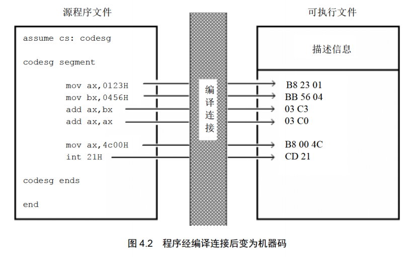
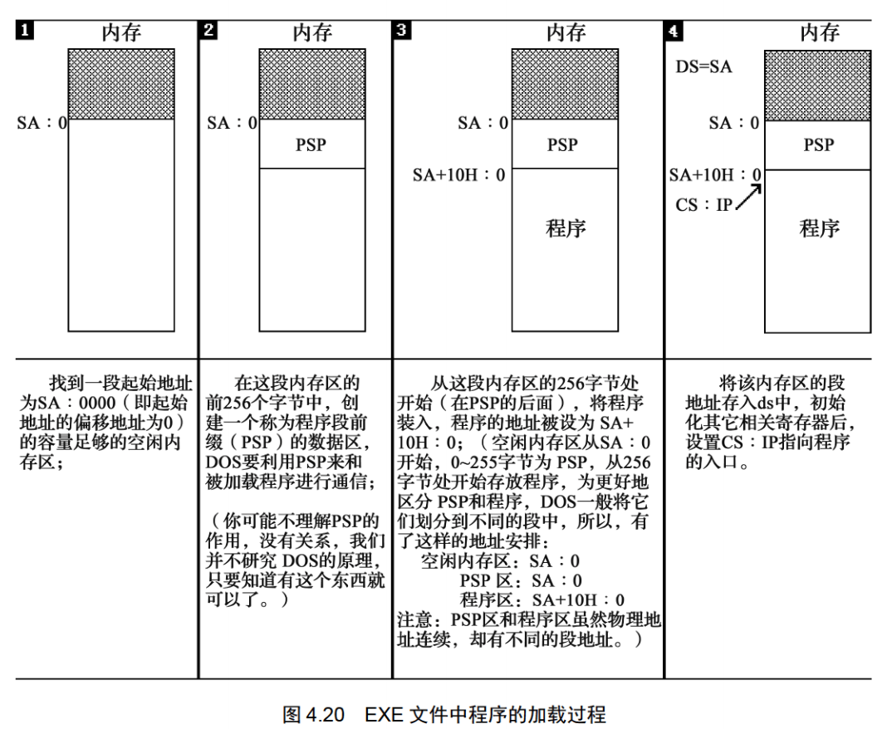

**①没有通过检测点不要向下学习； ②没有完成当前的实验不要向下学习**
## 第一章 基础知识
**学习目的：汇编课程的研宄重点放在如何利用硬件系统的编程结构和指令集有效灵活地控制系统进行工作。**
存储器被划分成多个存储单元， 存储单元从零开始顺序编号。 这些编号可以看作存储单元在存储器中的地址。  
cpu和其他芯片通过总线连接，总线从逻辑上可分为：地址总线、控制总线和数据总线。  
CPU 从 3 号单元中读取数据的过程(见图 1.3)如下。

>读一次数据需要三条总线共同完成：
(1) CPU 通过地址线将地址信息 3 发出。
(2) CPU 通过控制线发出内存读命令， 选中存储器芯片， 并通知它， 将要从中读取数据
(3) 存储器将 3 号单元中的数据 8 通过数据线送入 CPU。

一个 CPU 有 N根地址线， 则可以说这个CPU的地址总线的宽度为N。 这样的 CPU最多可以寻找2的N次方个内存单元。
数据总线的宽度决定了 CPU 和外界的数据传送速度。 8 根数据总线一次可传送一个 8 位二进制数据(即一个字节)。 16 根数据总线一次可传送两个字节。
控制总线是一些不同控制线的集合。 有多少根控制总线， 就意味着 CPU 提供了对外部器件的多少种控制。 所以， 控制总线的宽度决定了 CPU 对外部器件的控制能力。
#### 1.1~1.10小结
>(1) 汇编指令是机器指令的助记符， 同机器指令一一对应。
(2) 每一种 CPU 都有自己的汇编指令集。
(3) CPU 可以直接使用的信息在存储器中存放。
(4) 在存储器中指令和数据没有任何区别， 都是二进制信息。
(5) 存储单元从零开始顺序编号。
(6) —个存储单元可以存储8个bit，即8位二进制数。
(7) lByte=8bit 1KB=1024B 1MB=1024KB 1GB=1024MB。
(8) 每一个 CPU 芯片都有许多管脚， 这些管脚和总线相连。也可以说，这些管脚引出总线。 一个CPU 可以引出 3 种总线的宽度标志了这个 CPU 的不同方面的性能：
地址总线的宽度决定了 CPU 的寻址能力；
数据总线的宽度决定了 CPU 与其他器件进行数据传送时的一次数据传送量;
控制总线的宽度决定了 CPU 对系统中其他器件的控制能力。

#### 监测点1.1
>(1) 1个CPU的寻址能力为8KB，那么它的地址总线的宽度为(13).
(2)1KB的存储器有(1024)个存储单元。存储单元的编号从(0)到(1023).
(3)lKB的存储器可以存储(1024*8)个bit，(1024)个Byte。
(4)1GB、1MB、1KB分别是(1024\*1024\*1024,1024\*1024,1024)Byte.
(5) 8080、8088、80286、80386的地址总线宽度分别为l6 根、20 根、24根、32根，则它们的寻址能力分别为:(2^6)(KB)、(1)(MB)、(2^4)(MB)、(2^2)(GB)。
(6) 8080、8088、8086、80286、80386的数据总线宽度分别为8根、8根、16根、16根、32根。则它们一次可以传送的数据为:(1)(B)、(1)(B)、(2)(B)、(2)(B)、(4)(B)。
(7)从内存中读取1024字节的数据，8086至少要读(512)次，80386至少要读(256)次。
(8)在存储器中，数据和程序以(二进制)形式存放。

存储芯片从读写属性上可分为两类：随机存储器(RAM)和只读存储器(ROM)。
图 1.7 展示了 PC 系统中各类存储器的逻辑连接情况。
  
CPU 在操控上述存储器的时候， 把它们都当作内存来对待， 把它们总的看作
一个由若干存储单元组成的逻辑存储器， 这个逻辑存储器就是我们所说的内存地址空间。
图 1.8 展示了 CPU 将系统中各类存储器看作一个逻辑存储器的情况。
  
在图 1.8 中， 所有的物理存储器被看作一个由若干存储单元组成的逻辑存储器， 每个物理存储器在这个逻辑存储器中占有一个地址段， 即一段地址空间。 CPU 在这段地址空间中读写数据， 实际上就是在相对应的物理存储器中读写数据。

不同的计算机系统的内存地址空间的分配情况是不同的， 图 1.9 展示了 8086PC 机内存地址空间分配的基本情况。
  

## 第二章 寄存器
#### 通用寄存器
AX、 BX、 CX、 DX 这4个寄存器通常用来存放一般性的数据，被称为通用寄存器。其都可以分解为两个8位寄存器来使用。
  
  
**在以后的课程中， 为了区分不同的进制， 在十六进制表示的数据的后面加 H， 在二进制表示的数据后面加 B， 十进制表示的数据后面什么也不加。**
**在写一条汇编指令或一个寄存器的名称时不区分大小写。**
**在进行数据传送或运算时， 要注意指令的两个操作对象的位数应当是一致的。即8位寄存器对8位寄存器，16位对16位。**
>汇编加法导致溢出的情况：若超过寄存器位数限制，高位直接抛弃。
示例1：程序段中的最后一条指令 add ax,bx， 在执行前 ax 和 bx 中的数据都为 8226H， 相加后所得的值为： 1044CH， 但是 ax 为 16 位寄存器， 只能存放 4 位十六进制的数据， 所以最高位的1不能在ax中保存，ax中的数据为:044CH。
示例2：程序段中的最后一条指令 add al,93H, 在执行前， al 中的数据为 C5H， 相加后所得的值为： 158H, 但是 al 为 8 位寄存器， 只能存放两位十六进制的数据， 所以最高位的 1 丢失，ax中的数据为： 0058H。这种情况下，al作为一个独立的8为寄存器来使用，和ah没有关系，cpu在执行这条指令时认为ah和al是两个不相关的寄存器。

#### 监测点2.1（第一题略过）
>（2）只能使用目前学过的汇编指令， 最多使用 4 条指令， 编程计算 2 的 4 次方。
```bash
add ax, 2
add ax, 2
add ax, 2
add ax, 2
```
#### 16位结构的cpu
>运算器一次最多可以处理 16 位的数据
寄存器的最大宽度为 16 位；
寄存器和运算器之间的通路为 16 位。
#### 8086cpu给出物理地址的方法
8086CPU 有 20 位地址总线， 可以传送20位地址，达到1MB寻址能力。8086CPU 采用一种在内部用两个 16 位地址合成的方法来形成一个 20 位的物理地址。
  
>如图 2.6 所示， 当 8086CPU 要读写内存时:
(1) CPU 中的相关部件提供两个 16 位的地址， 一个称为段地址， 另一个称为偏移地址；
(2) 段地址和偏移地址通过内部总线送入一个称为地址加法器的部件；
(3) 地址加法器将两个 16 位地址合成为一个 20 位的物理地址；
(4) 地址加法器通过内部总线将 20 位物理地址送入输入输出控制电路；
(5) 输入输出控制电路将 20 位物理地址送上地址总线；
(6) 20 位物理地址被地址总线传送到存储器。

地址加法器采用物理地址=段地址X16+偏移地址的方法用段地址和偏移地址合成物理
地址。其本质为基础地址+偏移地址=物理地址。例如， 8086CPU 要访问地址为 123C8H 的内存单元，此时， 地址加法器的工作过程如图 2.7 所示(图中数据皆为十六进制表示)。
  
#### 左移操作和乘法的关系
> (1) 一个数据的二进制形式左移 1 位， 相当于该数据乘以 2;
(2) 一个数据的二进制形式左移 N 位， 相当于该数据乘以 2 的 N 次方；
(3) 地址加法器如何完成段地址x l6 的运算？ 就是将以二进制形式存放的段地址左移 4 位。
**一个 X 进制的数据左移 1 位， 相当于乘以 X。**

#### 段的概念
内存并没有分段， 段的划分来自于 CPU,如图 2.9 所示， 我们可以认为： 地址 10000H 100FFH 的内存单元组成一个段， 该段的起始地址(基础地址)为 10000H， 段地址为 1000H, 大小为 100H； 我们也可以认为地址 10000H 1007FH、 10080H 100FFH 的内存单元组成两个段， 它们的起始地址(基础地址)为： 10000H 和 10080H, 段地址为： 1000H 和 1008H, 大小都为 80H。
  
在编程时可以根据需要， 将若干地址连续的内存单元看作一个段， 用段地址 X16 定位段的起始地址(基础地址)， 用偏移地址定位段中的内存单元。 有两点需要注意： 段地址X16 必然是 16 的倍数， 所以一个段的起始地址也一定是 16 的倍数； 偏移地址为 16 位， 16 位地址的寻址能力为 64KB， 所以一个段的长度最大为 64KB。
CPU 可以用不同的段地址和偏移地址形成同一个物理地址。
#### 监测点2.2
(1)给定段地址为0001H，仅通过变化偏移地址寻址，CPU的寻址范围为（00010H）到（00010H+FFFFH=1000FH）。
(2)有一数据存放在内存20000H单元中，现给定段地址为SA，若想用偏移地址寻到此单元。则SA应满足的条件是:最小为（1000H），最大为（2000H）。
提示，反过来思考一下，当段地址给定为多少，CPU无论怎么变化偏移地址都无法寻到20000H单元?

#### 段寄存器
段地址在 8086CPU 的段寄存器中存放。 8086CPU 有 4 个 段 寄 存 器： CS、 DS、 SS、 ES。 当8086CPU 要访问内存时由这 4 个段寄存器提供内存单元的段地址。 
#### CS和IP
CS 和 IP 是 8086CPU 中两个最关键的寄存器， 它们指示了 CPU 当前要读取指令的地址。 CS 为代码段寄存器， IP 为指令指针寄存器。
在 8086PC 机中， 任意时刻， 设 CS 中的内容为 M， IP 中的内容为 N， 8086CPU 将从内存 Mxl6+N 单元开始， 读取一条指令并执行。即8086 机中， 任意时刻， CPU 将 CS:IP 指向的内容当作指令执行。
  
>图 2.10 说明如下。
(1) 8086CPU 当前状态： CS 中的内容为 2000H， IP 中的内容为 0000H;
(2) 内存 20000H 20009H 单元存放着可执行的机器码；
(3) 内存 20000H 20009H 单元中存放的机器码对应的汇编指令如下。
地址： 20000H 20002H 内容： B8 23 01 长度： 3Byte, 对应汇编指令： movax,0123H
地址： 20003H 20005H 内容： BB 03 00 长度： 3Byte, 对应汇编指令： movbx,0003H
地址： 20006H 20007H, 内容： 89 D8, 长度： 2Byte, 对应汇编指令： mov ax,bx
地址： 20008H 20009H, 内容： 01 D8, 长度： 2Byte, 对应汇编指令： addax,bx

下面的一组图(图 2.11 图 2.19)， 以图 2.10 描述的情况为初始状态， 展示了 8086CPU读取、 执行一条指令的过程。 注意每幅图中发生的变化.
  
  
  
  
  
  
  
  
  
下面的一组图(图2.20~图2.26)，以图2.19的情况为初始状态，展示了8086CPU继续读取、执行3条指令的过程。注意IP的变化(下面的描述中，隐蔽了读取每条指令的细节)。
  
  
  
  
  

  
  
> 8086cpu的工作过程简述如下：
> (1)从CS:IP指向的内存单元读取指令，读取的指令进入指令缓冲器;
> (2)IP-IP+所读取指令的长度，从而指向下一条指令;
> (3)执行指令。转到步骤(1)，重复这个过程。
在8086CPU加电启动或复位后(即CPU刚开始工作时)CS和IP被设置为CS=FFFFH，IP=0000H，即在8086PC机刚启动时，CPU从内存FFFFOH单元中读取指令执行，FFFFOH单元中的指令是8086PC机开机后执行的第一条指令。
#### 指令长度的确定
来源：https://blog.csdn.net/qq_36499686/article/details/78302165
汇编指令长度与寻址方式有关，规律或原则如下：
一、没有操作数的指令，指令长度为1个字节
二、操作数只涉及寄存器的的指令，指令长度为2个字节
    如：mov bx,ax
三、操作数涉及内存地址的指令，指令长度为3个字节
    如：mov ax,ds:\[bx+si+idata]
四、操作数涉及立即数的指令，指令长度为：寄存器类型+1
    8位寄存器，寄存器类型=1，如：mov al,8；指令长度为2个字节
    16位寄存器，寄存器类型=2，如：mov ax,8；指令长度为3个字节
五、跳转指令，分为2种情况：
1、段内跳转（指令长度为2个字节或3个字节）
jmp指令本身占1个字节
段内短转移，8位位移量占一个字节，加上jmp指令一个字节，整条指令占2个字节
如：jmp short opr
段内近转移，16位位移量占两个字节，加上jmp指令一个字节，整条指令占3个字节
如：jmp near ptr opr
2、段间跳转，指令长度为5个字节
如：jmp dword ptr table[bx][di]
或  jmp far ptr opr
或  jmp dword ptr opr 
注意：形如“jmp 1234:5678”的汇编指令，是在Debug中使用的汇编指令，汇编编译器并不认识，如果在源程序中使用，那么在编译时便会报错。

**在任何时候， CPU 将 CS、 IP 中的内容当作指令的段地址和偏移地址， 用它们合成指令的物理地址， 到内存中读取指令码， 执行。 如果说， 内存中的一段信息曾被 CPU 执行过的话， 那么， 它所在的内存单元必然被 CS:IP 指向过。**

#### 修改CS和IP的值
程序员通过改变CS和IP的内容，来控制CPU执行目标的指令。
传送指令mov无法修改CS和IP的值，只能通过转移指令进行修改，如jmp指令。
jmp语法如下：jmp 段地址:偏移地址。用指令中给出的段地址修改CS，偏移地址修改IP。
示例：
jmp 2AE3:3，执行后:CS=2AE3H，IP=0003H，CPU将从2AE33H 处读取指令。
jmp 3:0B16，执行后:CS=0003H，IP-OB16H，CPU将从00B46H 处读取指令。

若想仅修改 IP 的内容， 可用形如 “jmp 某一合法寄存器” 的指令完成，用寄存器中的值修改 IP。如：
jmp ax，指令执行前: ax=1000H，CS=2000H，IP=0003H
        指令执行后: ax=1000H，CS=2000H，IP=1000H
jmp bx，指令执行前: bx=0B16H，CS=2000H，IP=0003H
        指令执行后: bx=0B16H，CS=2000H，IP=0B16H
jmp ax和mov IP,ax含义一致，但后者不是合法语句。
通过jmp跳转之后，cpu会从挑战后的地方继续执行。示例：
>内存中存放的机器码和对应的汇编指令情况如图 2.27 所示， 设 CPU 初始状态:CS=2000H, IP=0000H, 执行序列为：
(1) mov ax,6622H
(2) jmp 1000:3
(3) mov ax,0000
(4) mov bx,ax
(5) jmp bx
(6) mov ax,0123H
(7)转到第3步执行
  

#### 代码段
可以人为的将长度为 N(N<64KB)的一组代码， 存在一组地址连续、 起始地址为 16 的倍数的内存单元中，将其看做代码段。
**将一段内存当作代码段， 仅仅是我们在编程时的一种安排， CPU 并不会由于这种安排， 就自动地将我们定义的代码段中的指令当作指令来执行。 CPU 只认被 CS:IP 指向的内存单元中的内容为指令。 所以， 要让 CPU 执行我们放在代码段中的指令， 必须要将 CS:IP 指向所定义的代码段中的第一条指令的首地址。**

#### 小结
(1)段地址在8086CPU 的段寄存器中存放。当8086CPU要访问内存时，由段寄存器提供内存单元的段地址。8086CPU有4个段寄存器，其中CS用来存放指令的段地址。
(2)CS存放指令的段地址，IP存放指令的偏移地址。
8086机中，任意时刻，CPU将CS:IP指向的内容当作指令执行。
(3)8086CPU的工作过程:
1. 从CS:IP指向的内存单元读取指令，读取的指令进入指令缓冲器;
2. IP指向下一条指令;
3. 执行指令。(转到步骤1，重复这个过程。)
4. 8086CPU提供转移指令修改CS、IP的内容。
#### 监测点2.3
下面的3条指令执行后，CPU几次修改IP?都是在什么时候?最后IP中的值是多少?
mov ax,bx
sub ax,ax
jmp ax
备注：sub是减法指令，上面那句等效于于c语言ax=ax-bx。
答：3次。执行一条语句，修改一次，共修改2次，最后jmp单独修改一次。共三次。
### 实验1：查看cpu和内存，用机器指令和汇编指令编程
#### 预备知识： Debug 的使用

>环境说明：
win10无法执行debug命令，作者书中使用的系统为win2000，本人使用winxp虚拟机，可以正常运行debug，但现实和作者的win2000有所出入。winxp下进入debug方法如下：
cmd窗口中输入debug，回车即可。
  


>常用命令
用Debug 的R命令查看、改变CPU寄存器的内容;`-r`, `-r ax`
用Debug 的D命令查看内存中的内容;`d 段地址:偏移地址` `-d 1000:0` 
用Debug 的E命令改写内存中的内容; 
  
用Debug 的U命令将内存中的机器指令翻译成汇编指令;
 
用Debug 的T命令执行一条机器指令;
  
用Debug 的A命令以汇编指令的格式在内存中写入一条机器指令。
  
用Debug 的Q命令退出debug。

  
实验结果：https://blog.csdn.net/OrangeHap/article/details/89790492
## 第三章 寄存器
字单元，即存放一个字型数据(16 位)的内存单元， 由两个地址连续的内存单元组成。 高地址内存单元中存放字型数据的高位字节， 低地址内存单元中存放字型数据的低位字节。
任何两个地址连续的内存单元， N 号单元和 N+1 号 单
元， 可以将它们看成两个内存单元， 也可看成一个地址为 N 的字单元中的高位字节单元和低位字节单元。
#### DS和[](address)
在 8086PC 中，内存地址由段地址和偏移地址组成。 8086CPU 中有一个 DS 寄存器， 通常用来存放要访问数据的段地址。 
```bash
mov al, [0]
# 0为偏移地址，指令执行时， 8086CPU 自动取 ds 中的数据为内存单元的段地址。
```
8086CPU 不支持将数据直接送入段寄存器的操作， ds 是一个段寄存器， 所以move ds，1000H 这条指令是非法的。只好用一个寄存器来进行中转， 即先将 1000H 送入一个一般的寄存器， 如 bx， 再将 bx 中的内容送入 ds。
只要在mov 指令中给出 16 位的寄存器就可以进行 16 位数据的传送了。比如:
```bash
mov bx, 1000H
mov ds, bx
mov ax, [0] ; 1000:0处的字型数据送入ax
mov [0], cx ; cx中的16为数据送到1000：0处
```
#### mov, add, sub指令
mov 寄存器，数据 比如：mov ax, 8
mov 寄存器，寄存器 比如：mov ax, bx
mov 寄存器，内存单元 比如:mov ax, [0]
mov 内存单元，寄存器 比如:mov [0], ax
mov 段寄存器，寄存器 比如：mov ds, ax

add 寄存器，数据 比如：add ax, 8
add 寄存器，寄存器 比如：add ax, bx
add 寄存器，内存单元 比如:add ax, [0]
add 内存单元，寄存器 比如:add [0], ax

sub 寄存器，数据 比如：sub ax, 8
sub 寄存器，寄存器 比如：sub ax, bx
sub 寄存器，内存单元 比如:sub ax, [0]
sub 内存单元，寄存器 比如:sub [0], ax

数据段和代码段定义类似，只不过存储的为数据。
下面代码实现累加数据段前3个字型数据：
```bash
mov ax,1000
mov ds,ax
mov ax,0
add ax,[0]
add ax,[2]
add ax,[4]
```
#### 小结
>(1) 字在内存中存储时， 要用两个地址连续的内存单元来存放， 字的低位字节存放在低地址单元中，高位字节存放在高地址单元中。
(2) 用 mov 指令访问内存单元， 可以在 mov 指令中只给出单元的偏移地址， 此时， 段地址默认在DS 寄存器中。
(3)[address]表示一个偏移地址为 address 的内存单元。
(4) 在内存和寄存器之间传送字型数据时， 高地址单元和高 8 位寄存器、 低地址单元和低 8 位寄存器相对应。
(5)mov、 add、 sub 是具有两个操作对象的指令。 jmp 是具有一个操作对象的指令。
(6) 可以根据自己的推测， 在 Debug 中实验指令的新格式。
#### cpu提供的栈机制
8086CPU 提供入栈和出栈指令， 最基本的两个是 PUSH(入栈） 和 POP(出栈)。 比如， push ax 表示将寄存器 ax 中的数据送入栈中， pop ax 表示从栈顶取出数据送入8086CPU 的入栈和出栈操作都是以字为单位进行的。
 8086CPU 中， 有两个寄存器， 段寄存器 SS 和寄存器 SP， 栈顶的段地址存放在 SS 中， 偏移地址存放在 SP 中。 任意时刻， SS:SP 指向栈顶元素。 push 指令和 pop 指令执行时， CPU 从 SS 和 SP 中得到栈顶的地址。

>push ax的执行，由以下两步完成：
(1) SP=SP-2, SS:SP 指向当前栈顶前面的单元， 以当前栈顶前面的单元为新的栈顶;
(2) 将 ax 中的内容送入 SS:SP 指向的内存单元处， SS:SP 此时指向新栈顶。

  

栈空的状态：
任意时刻， SS:SP 指向栈顶元素， 当栈为空的时候， 栈中没有元素，也就不存在栈顶元素， 所以 SS:SP 只能指向栈的最底部单元下面的单元， 该单元的偏移地址为栈最底部的字单元的偏移地址+2, 栈最底部字单元的地址为1000:000E, 所以栈空时， SP=0010H。
  
>pop ax的执行过程和push ax刚好相反，由以下两步完成：
(1) 将 SS:SP 指向的内存单元处的数据送入 ax 中；
(2) SP=SP+2, SS:SP 指向当前栈顶下面的单元， 以当前栈顶下面的单元为新的栈顶。

  
**出栈后， SS:SP 指向新的栈顶 1000EH， pop 操作前的栈顶元素，1000CH 处的 2266H 依然存在， 但是， 它己不在栈中。 当再次执行 push 等入栈指令后，SS:SP 移至 1000CH， 并在里面写入新的数据， 它将被覆盖。**

当栈满的时候再使用 push 指令入栈， 或栈空的时候再使用 pop 指令出栈， 都将发生栈顶超界问题。
8086CPU 不保证我们对栈的操作不会超界。因而需要程序员自己注意，避免越界。

>push和pop支持的操作：
push 寄存器; 将一个寄存器中的数据入栈
pop 寄存器; 出栈，用一个寄存器接受出栈的数据
push 段寄存器; 将一个段寄存器中的数据入栈
pop 段寄存器; 出栈，用一个段寄存器接受出栈的数据
push 内存单元; 将一个内存字单元处的字入栈（注意：栈操作都是以字为单位）
pop 内存单元; 出栈，用一个内存字单元接受出栈的数据

#### 栈的综述
>(1)8086CPU 提供了栈操作机制， 方案如下。
在 SS、 SP 中存放栈顶的段地址和偏移地址;
提供入栈和出栈指令， 它们根据 SS:SP 指示的地址， 按照栈的方式访问内存单元。
(2) push 指令的执行步骤： ①SP=SP-2; ②向 SS:SP 指向的字单元中送入数据。
(3) pop 指令的执行步骤： ①从 SS:SP 指向的字单元中读取数据； ②SP=SP+2。
(4) 任意时刻， SS:SP 指向桟顶元素。
(5) 8086CPU 只记录栈顶， 栈空间的大小我们要自己管理。
(6) 用栈来暂存以后需要恢复的寄存器的内容时， 寄存器出栈的顺序要和入栈的顺序相反。
(7) push, pop 实质上是一种内存传送指令， 注意它们的灵活应用。
栈是一种非常重要的机制， 一定要深入理解， 灵活掌握.

从栈操作指令所完成的功能的角度上来看， push, pop 等指令在执行的时候只修改 SP， 所以栈顶的变化范围是 0-FFFFH .从栈空时候的SP=0，一直压栈，直到栈满时SP=0；如果再次压栈，栈顶将环绕，覆盖了原来栈中的内容。所以一个栈段的容量最大为64k。
#### 段的综述
我们可以将一段内存定义为一个段， 用一个段地址指示段， 用偏移地址访问段内的单元。 这完全是我们自己的安排。
>我们可以用一个段存放数据， 将它定义为“ 数据段”
我们可以用一个段存放代码， 将它定义为“ 代码段”
我们可以用一个段当作栈， 将它定义为“ 栈段” 。
我们可以这样安排， 但若要让 CPU 按照我们的安排来访问这些段， 就要:
对于数据段， 将它的段地址放在 DS 中， 用mov，add,sub等访问内存单元的指令时，cpu就将我们定义的数据段中的内容当作数据来访问；
对于代码段， 将它的段地址放在 CS 中， 将段中第一条指令的偏移地址放在 IP 中， 这样 CPU 就将执行我们定义的代码段中的指令；
对于栈段， 将它的段地址放在 SS 中， 将栈顶单元的偏移地址放在 SP 中， 这样 CPU 在需要进行栈操作的时候， 比如执行 push、 pop 指令等， 就将我们定义的栈段当作栈空间来用

## 第一个程序
图4.1描述了一个汇编语言从程序写出到最终执行的简要过程，具体说明如下：
  
>第一步：编写汇编源程序
使用文本编辑器(如 Edit、 记事本等)， 用汇编语言编写汇编源程序。
第二步：对源程序进行编译连接
使用汇编语言编译程序对源程序文件中的源程序进行编译， 产生目标文件； 再用连接程序对目标文件进行连接， 生成可在操作系统中直接运行的可执行文件。可执行文件包含两部分：
（1）程序（从源程序中的汇编指令翻译过来的机器码）和数据（源程序中定义的数据）
（2）相关的描述信息（比如，程序有多大、要占用多少内存空间等）
第三步：执行可执行文件中的程序。
操作系统依照可执行文件中的描述信息， 将可执行文件中的机器码和数据加载入内存， 并进行相关的初始化(比如设置 CS:IP 指向第一条要执行的指令)， 然后由 CPU 执行程序。
#### 源程序
```bash
assume cs:codesg
codesg segment

    mov ax, 0123H
    mov bx, 0456H
    add ax, bx
    add ax, ax

    mov ax, 4c00H
    int 21H
codesg ends
end
```
在汇编语言源程序中， 包含两种指令， 一种是汇编指令， 一种是伪指令。 汇编指令是有对应的机器码的指令， 可以被编译为机器指令， 最终为 CPU 所执行。 而伪指令没有对应的机器指令， 最终不被 CPU 所执行。
##### 伪指令
上述代码中的伪指令：
(1)段标识
segment 和 ends 是一对成对使用的伪指令， 这是在写可被编译器编译的汇编程序时，必须要用到的一对伪指令。 segment 和 ends 的功能是定义一个段， segment 说明一个段开始， ends 说明一个段结束。 一个段必须有一个名称来标识， 使用格式为：
```asm
段名 segment
段名 ends
```
一个汇编程序是由多个段组成的， 这些段被用来存放代码、 数据或当作找空间来使用。 我们在前面的课程中所讲解的段的概念， 在汇编源程序中得到了应用与体现， 一个源程序中所有将被计算机所处理的信息： 指令、 数据、 栈， 被划分到了不同的段中。
(2)结束标记
end 是一个汇编程序的结束标记， 编译器在编译汇编程序的过程中， 如果碰到了伪指令 end， 就结束对源程序的编译。 
(3)assume
这 条 伪 指 令 的 含 义 为“ 假 设 ” 。 它 假 设 某 一 段 寄 存 器 和 程 序 中 的 某 一 个 用
segment...ends 定义的段相关联。 通过assume说明这种关联，在需要的情况下， 编译程序可以将段寄存器和某一个具体的段相联系。
##### 程序
将源程序中最终由计算机执行、 处理的指令或数据， 称为程序。 程序最先以汇编指令的形式存在源程序中， 经编译、连接后转变为机器码， 存储在可执行文件中。
  

##### 标号
汇编源程序中， 除了汇编指令和伪指令外， 还有一些标号， 比如 “codesg” 。 一个标号指代了一个地址。 
  
#### 汇编程序从写出到执行的过程
  

#### DOS系统中.exe文件的程序加载过程
  

## 第5章 [BX]和loop指令
